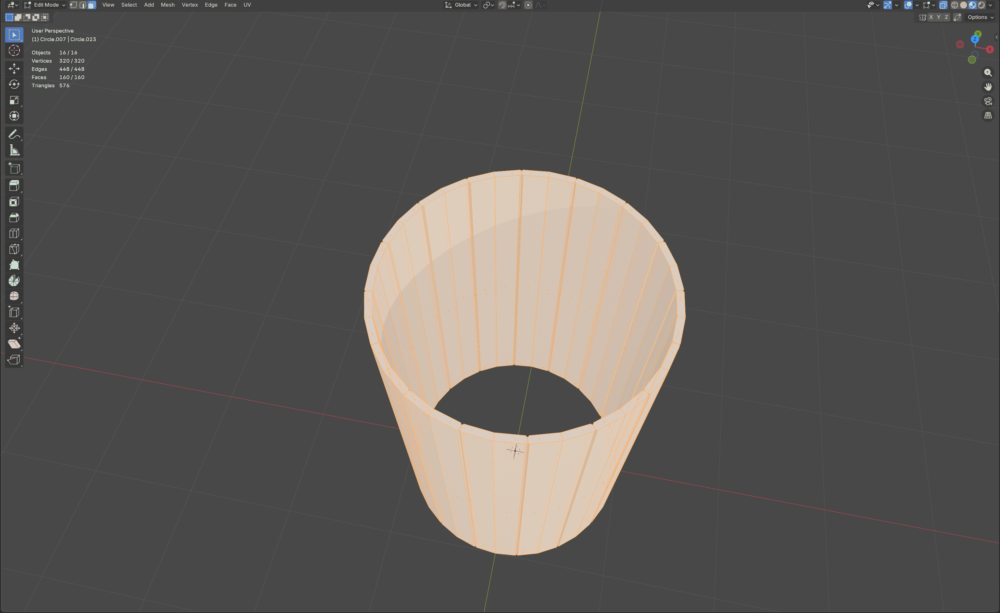
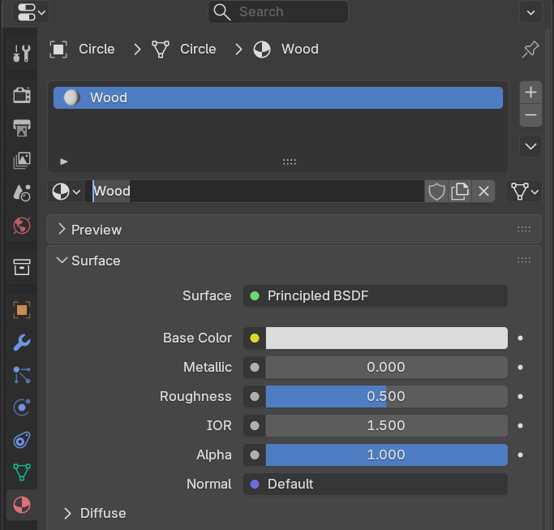

# Game Object Modeling: Barrel

## Blender Workflow

1️⃣ Barrel Lid

### Creating the Lid Base
- Add a circle:

Shift + A -> Mesh -> Circle

- Enter Edit Mode and Vertex Select:

Tab -> 1

- Connect vertices to form edges:  
  - Select vertices (Shift or drag select)  
  - Press **F** to connect  

- Complete lid shape by connecting remaining vertices  

- Fill all faces:

A -> F

- Apply **Solidify Modifier** for thickness  

### Adding Details
- Switch to Edge Select, select edges to bevel  

- Bevel tool: drag yellow handle or set Width in the menu  

- Remove unnecessary faces:  

X -> Faces

- Separate sections for texturing:

P -> Separate by Selection

- Connect missing edges individually (F) to avoid unwanted connections  

2️⃣ Barrel Body

- Add circle for base:

Shift + A -> Mesh -> Circle

- Extrude vertically for barrel height:

Select edges -> E -> extrude

- Apply **Solidify Modifier** and set thickness  

- Bevel every second edge (outer + inner)  

- Delete unnecessary faces:

X -> Faces

- Separate each plank as individual objects and organize into a collection `BarrelBody`  

- Connect edges individually  

- Add Details to change shape:

Right click -> Subdivide

- Select the horizontal lines and Scale:

S -> 1.1

S -> 1.05

- Barrel Body

3️⃣ Hoops

- Add circle mesh, move to desired position, resize with **S**, extrude **E**  

- Apply **Solidify Modifier** (Offset = 1) and adjust thickness, then apply  

- Duplicate and position additional hoops  

- Apply metal material with Principled BSDF workflow  

- UV unwrap with Cube Projection  

4️⃣ Materials & Textures

- Wood Texture: [Wood035](https://ambientcg.com/view?id=Wood035)  
- Metal Texture: [Metal052C](https://ambientcg.com/view?id=Metal052C)

- Add new material to all parts, rename it  

- Enable **Node Wrangler** addon:  

Edit -> Preferences -> Add-ons -> Node Wrangler

- Principled BSDF -> **Ctrl + Shift + T** -> load textures -> Principled Texture Setup  

- UV unwrap all objects (Smart UV Project)  

- Adjust top/bottom faces projection to Vertical

- Organize objects into collections for clean project structure  

5️⃣ Final Adjustments & Optimization

- Apply **Shade Auto Smooth** to all objects  

- Set origin to **Center of Geometry**  

- Check object stats:

Objects: 34
Vertices: 5,712
Edges: 10,392
Faces: 4,740
Triangles: 11,304

- Optimize geometry:  

Mesh -> Clean Up -> Limited Dissolve

- Set Max Angle ~4.5-5°  

- Final optimized stats:

Objects: 34
Vertices: 1,712
Edges: 2,736
Faces: 1,084
Triangles: 3,304

> Model is now ready for Unity testing and documentation.

6️⃣ Scaling & Export

### Setting the Correct Scale

Before exporting the model to a game engine, it is important to ensure that the object has a realistic and consistent scale.

In Blender, the default unit scale is:

1 Blender Unit = 1 meter

The barrel should have an approximate real-world size.

Typical barrel dimensions used in games:

- Height: **~0.9 m (900 mm)**
- Diameter: **~0.6 m**

To check the current size of the object:

1. Select the barrel.
2. Open the **Item panel** (`N` key).
3. Check the **Dimensions** values.

If the model is not the correct size, we can scale it using the **Scale tool**.

Press:

S → adjust the scale until the height reaches approximately **900 mm**.

### Applying Transformations

After scaling the model, we need to apply the transformations so the game engine reads the correct values.

1. Select all barrel objects (`A`).
2. Press:

Ctrl + A → Apply → **All Transforms**

This resets the transform values while keeping the model at the correct size.

### Exporting the Model

Once the model has the correct scale and transformations applied, it can be exported for use in a game engine.

1. Go to:

File → Export → **FBX (.fbx)**

2. In the export settings use the following configuration:

Include

- **Selected Objects** enabled
- **Object Types: Mesh**

Transform

- Scale: **1.00**
- Apply Unit: **Enabled**
- Apply Transform: **Enabled**

Geometry

- Apply Modifiers: **Enabled**
- Smoothing: **Normals Only**

These settings ensure that only the barrel mesh is exported and that the model keeps the correct orientation and scale when imported into a game engine such as Unity.

> The barrel model is now correctly scaled and exported as a **game-ready asset**.

