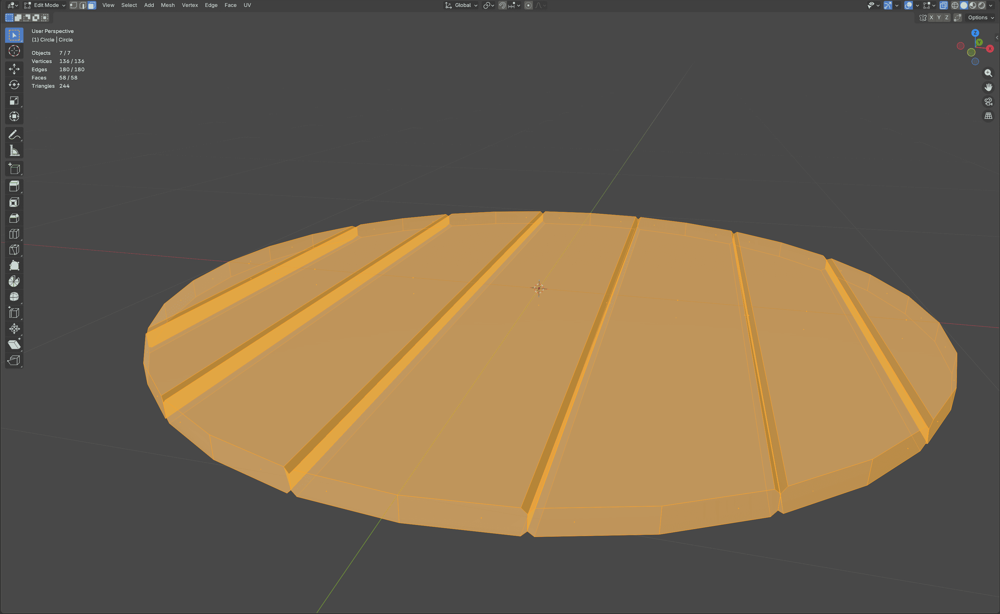

# 3D Modeling in Games – Bachelor's Thesis Documentation

## Chapter 1: Creating the Barrel Lid in Blender

The barrel lid (the top wooden cover) serves as the foundation for the entire barrel model. This chapter provides a complete, reproducible step-by-step guide to modeling, detailing, separating, and texturing the lid using Blender 4.x. The process focuses on clean topology, realistic plank structure, and professional PBR texturing.

All steps were performed with **Metric** units (millimeters) for game-ready scale.

### 1. Adding the Base Circle
In **Object Mode**, press **Shift + A** → **Mesh** → **Circle**.  
This creates a perfect circular base with 32 vertices – ideal starting topology for a round wooden lid.

**Tip:** Switch to **Top Orthographic** view (Numpad 7) and enable **X-Ray** (Alt + Z) for better visibility during early modeling.

### 2. Entering Edit Mode and Selecting Vertices
Press **Tab** to enter **Edit Mode**.  
Press **1** to switch to **Vertex Select** mode.  
Select two adjacent vertices (hold **Shift** or drag with the selection tool).

### 3. Connecting the First Edge
With the two vertices selected, press **F** to create an edge. This forms the foundation of the plank pattern.

### 4. Building the Plank Pattern
Repeat the edge-creation process (select two vertices → **F**) across the circle to form the desired radial plank layout typical for a wooden barrel lid.

### 5. Filling the Faces
Press **A** to select all vertices.  
Press **F** to fill the faces.

**Result:** A solid flat disc ready for thickness.

### 6. Adding the Solidify Modifier
In **Object Mode**, go to the **Modifier Properties** panel → **Add Modifier** → **Generate** → **Solidify**.

### 7. Setting Thickness
Set **Thickness** to **0.05 mm** (very thin for a realistic lid).  
Leave **Offset** at -1.000 and enable **Fill Rim**.

### 8. Applying the Modifier
Return to **Object Mode**.  
In the modifier panel, click the dropdown arrow next to **Solidify** → **Apply**.

**Result:** The lid now has real geometry thickness.

### 9. Adding Bevel Detail (Edges)
Switch to **Edge Select** mode (**2**).  
Select all outer and inner radial edges you want to bevel.  
Press **Ctrl + B** (Bevel tool).

Drag the yellow handle to create the bevel. Release and open the **Bevel** panel in the bottom-left corner.

Set:
- **Width Type**: Offset
- **Width**: 0.01 mm
- **Segments**: 1
- **Profile Shape**: 0.500
- **Profile Type**: Superellipse

### 10. Removing Inner Faces
Switch to **Face Select** mode (**3**).  
Select all newly created inner faces from the bevel.  
Press **X** → **Faces**.

**Result:** Clean plank separation with beveled edges.

### 11. Separating Planks for Texturing
Select one plank section (face loop).  
Press **P** → **Selection** to separate into a new object.  
Repeat for every plank.

### 12. Closing Missing Edges
In **Edit Mode** (per object), select the three missing edge pairs (top, middle, bottom) one by one and press **F**.  
Do **not** select everything at once – it would create incorrect faces.

### 13. Creating and Assigning the Wood Material
Select all lid objects (**A**).  
In the **Material Properties** panel, click **New** and rename the material to **Wood**.

### 14. Preparing Node Wrangler Add-on
Go to **Edit** → **Preferences** → **Add-ons**.  
Search for **Node Wrangler** and enable it.

**Tip:** This add-on is essential for fast PBR texture setup.

### 15. Switching to Shading Workspace
Change the workspace to **Shading** (top tab).

### 16. Importing PBR Textures (Wood035)
Select the **Principled BSDF** node.  
Press **Ctrl + Shift + T**.  
Navigate to the unpacked `Wood035` folder from [ambientcg.com](https://ambientcg.com/view?id=Wood035) and select all texture files.  
Click **Principled Texture Setup**.

### 17. Material Preview
The lid should now appear brown (raw texture).

### 18. Fixing UV Mapping
Select all objects → **Edit Mode**.  
Right-click → **UV** → **Unwrap Faces** → **Smart UV Project**.  
In the operator panel:
- **Angle Limit**: 89°
- **Rotation Method**: Axis-aligned (Horizontal)

**Result:** Perfectly aligned wood grain.

### 19. Organizing the Project
Create a new Collection named **BarrelLid**.  
Move all lid objects into it.  
Hide the collection with the eye icon (we will use it later).

**Chapter complete.** The barrel lid is now fully modeled, separated, UV-unwrapped, and textured with high-quality PBR wood material – ready for the barrel body in the next chapter.

---
