# 3D Modeling in Games – Model Creation Documentation

## Chapter 1: Creating the Barrel Lid in Blender

The barrel lid (the top wooden cover) serves as the foundation for the entire barrel model. This chapter provides a complete, reproducible step-by-step guide to modeling, detailing, separating, and texturing the lid using Blender. The process focuses on clean topology, realistic plank structure, and professional PBR texturing.

All steps were performed with **Metric** units (millimeters) for game-ready scale.

### 1. Adding the Base Circle
In **Object Mode**, press **Shift + A** → **Mesh** → **Circle**.  
This creates a perfect circular base with 32 vertices – ideal starting topology for a round wooden lid.

<table>
<tr><th width="100%">Adding the base circle</th></tr>
<tr><td>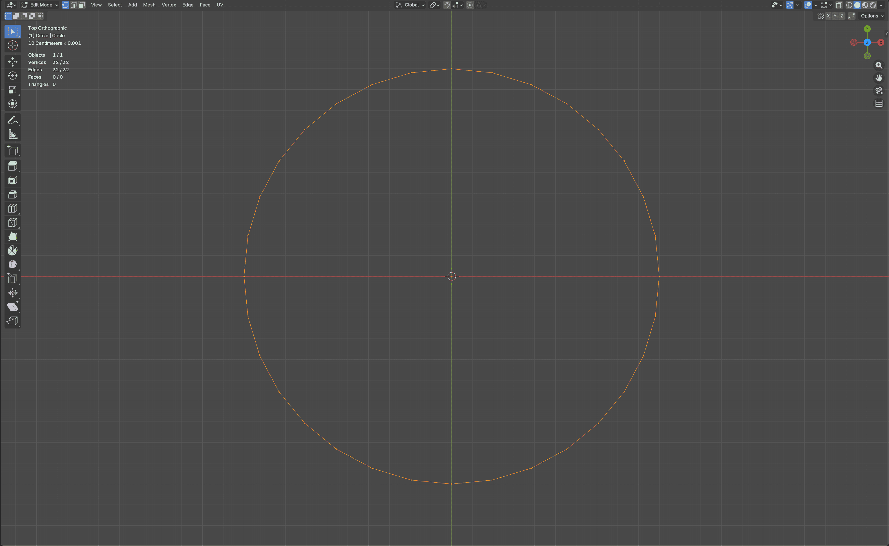</td></tr>
</table>

**Tip:** Switch to **Top Orthographic** view (Numpad 7) and enable **X-Ray** (Alt + Z) for better visibility during early modeling.

### 2. Entering Edit Mode and Selecting Vertices
Press **Tab** to enter **Edit Mode**.  
Press **1** to switch to **Vertex Select** mode.  
Select two adjacent vertices (hold **Shift** or drag with the selection tool).

<table>
<tr><th width="100%">Entering Edit Mode and selecting vertices</th></tr>
<tr><td>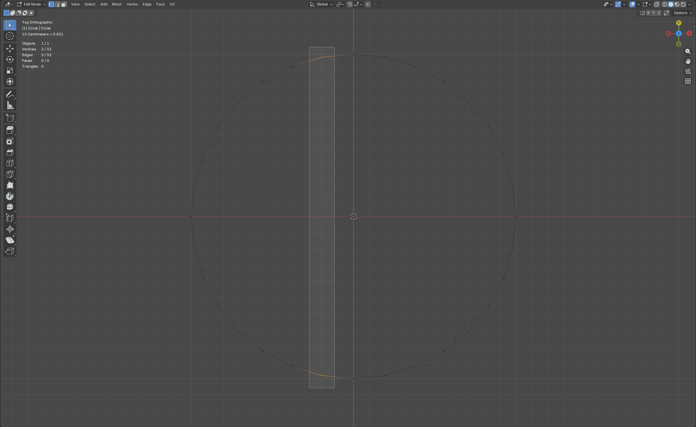</td></tr>
</table>

### 3. Connecting the First Edge
With the two vertices selected, press **F** to create an edge. This forms the foundation of the plank pattern.

<table>
<tr><th width="100%">Connecting the first edge</th></tr>
<tr><td>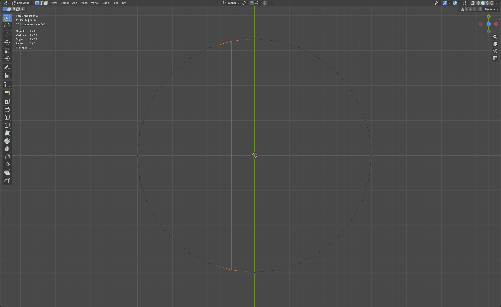</td></tr>
</table>

### 4. Building the Plank Pattern
Repeat the edge-creation process (select two vertices → **F**) across the circle to form the desired radial plank layout typical for a wooden barrel lid.

<table>
<tr><th width="100%">Building the plank pattern</th></tr>
<tr><td>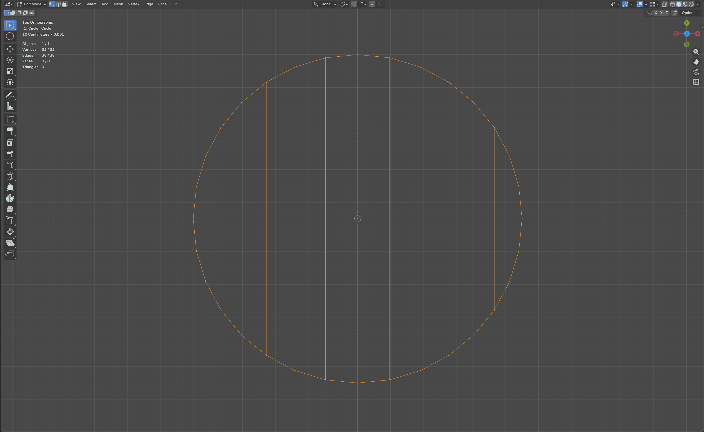</td></tr>
</table>

### 5. Filling the Faces
Press **A** to select all vertices.  
Press **F** to fill the faces.

<table>
<tr><th width="100%">Filling the faces</th></tr>
<tr><td>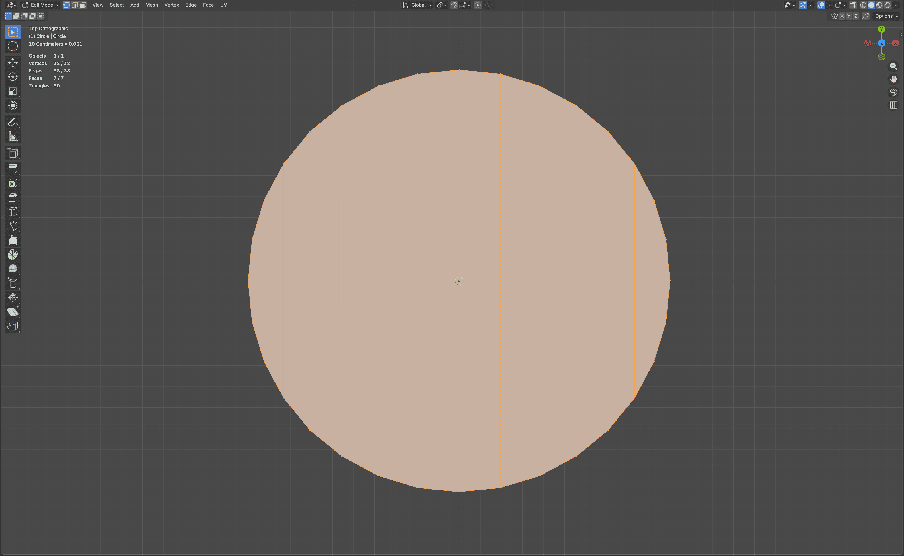</td></tr>
</table>

**Result:** A solid flat disc ready for thickness.

### 6. Adding the Solidify Modifier
In **Object Mode**, go to the **Modifier Properties** panel → **Add Modifier** → **Generate** → **Solidify**.

<table>
<tr><th width="100%">Adding the Solidify modifier</th></tr>
<tr><td>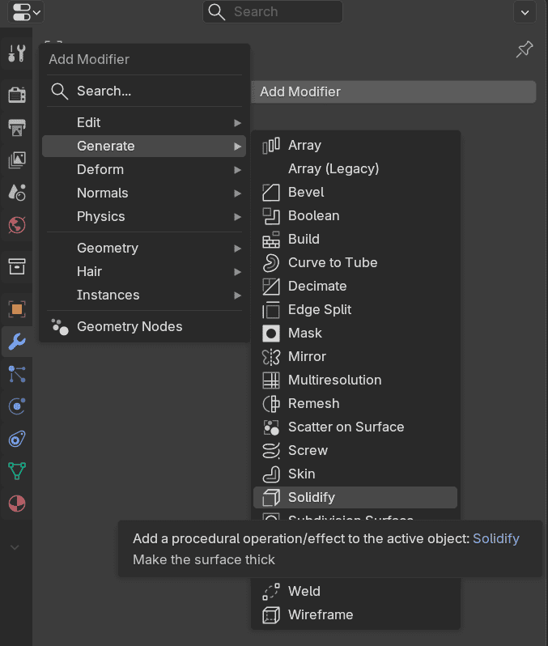</td></tr>
</table>

### 7. Setting Thickness
Set **Thickness** to **0.05 mm** (very thin for a realistic lid).  
Leave **Offset** at -1.000 and enable **Fill Rim**.

<table>
<tr><th width="100%">Solidify modifier settings</th></tr>
<tr><td>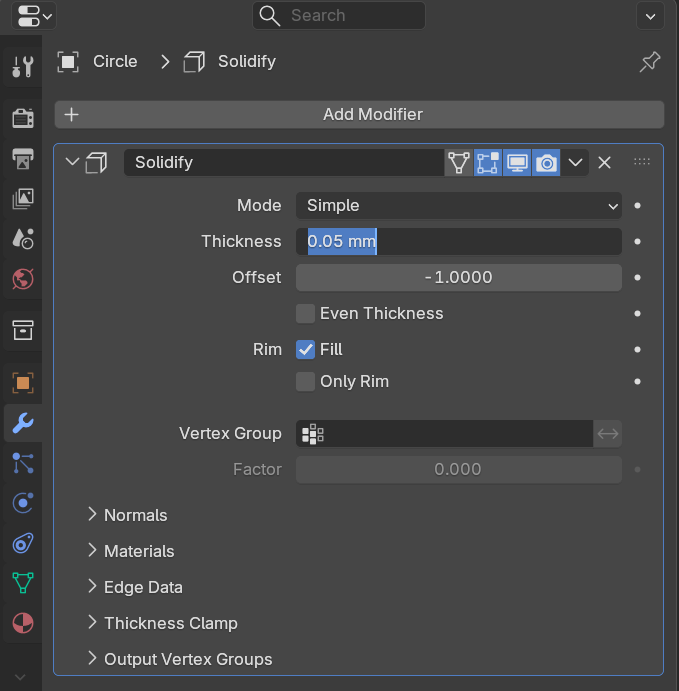</td></tr>
</table>

### 8. Applying the Modifier
Return to **Object Mode**.  
In the modifier panel, click the dropdown arrow next to **Solidify** → **Apply**.

<table>
<tr><th width="100%">Applying the Solidify modifier</th></tr>
<tr><td>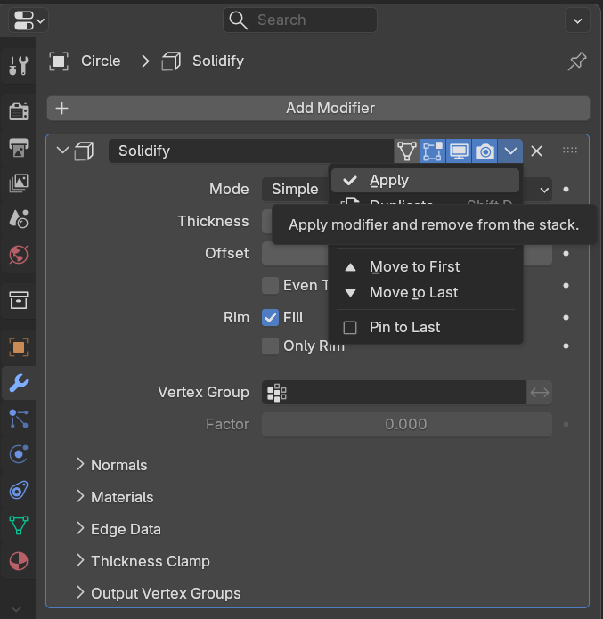</td></tr>
</table>

**Result:** The lid now has real geometry thickness.

<table>
<tr><th width="100%">Lid after applying Solidify</th></tr>
<tr><td>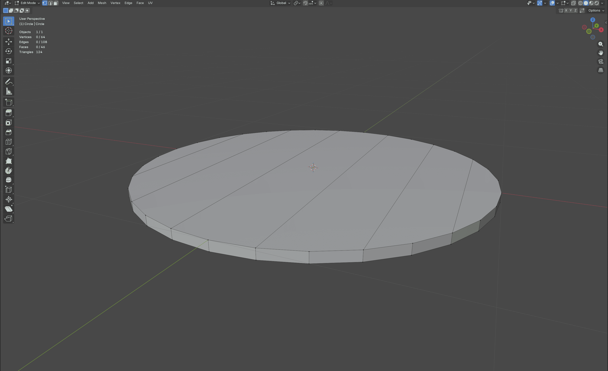</td></tr>
</table>

### 9. Adding Bevel Detail (Edges)
Switch to **Edge Select** mode (**2**).  
Select all outer and inner radial edges you want to bevel.  
Press **Ctrl + B** (Bevel tool).

<table>
<tr><th width="100%">Activating Bevel tool</th></tr>
<tr><td>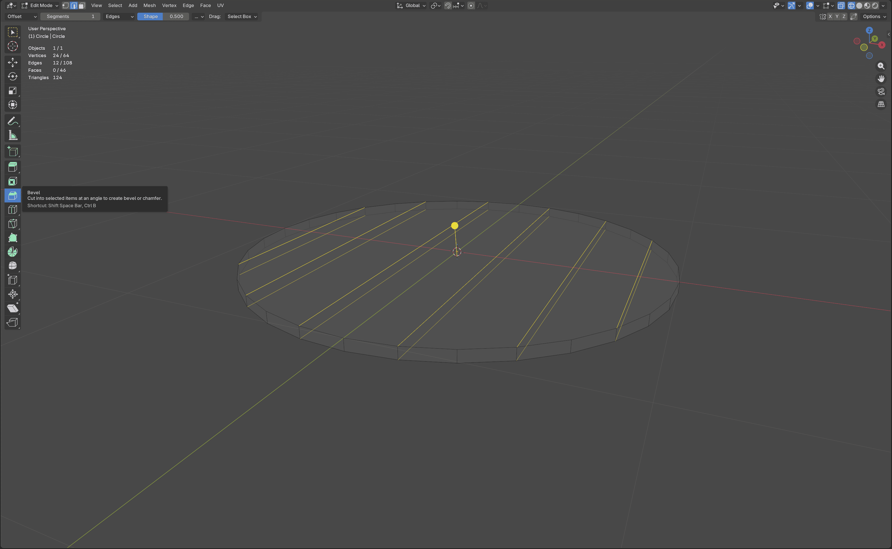</td></tr>
</table>

Drag the yellow handle to create the bevel. Release and open the **Bevel** panel in the bottom-left corner.

<table>
<tr><th width="100%">Bevel applied</th></tr>
<tr><td>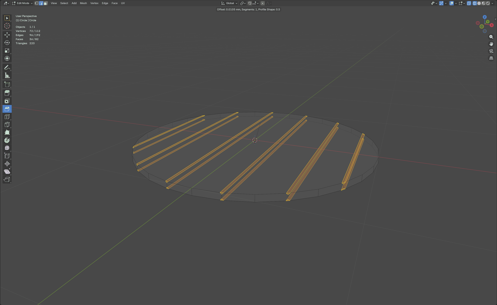</td></tr>
</table>

Set:
- **Width Type**: Offset
- **Width**: 0.01 mm
- **Segments**: 1
- **Profile Shape**: 0.500
- **Profile Type**: Superellipse

<table>
<tr><th width="100%">Precise Bevel settings</th></tr>
<tr><td>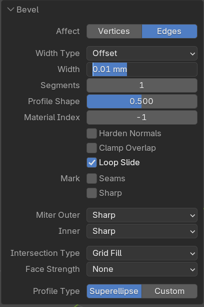</td></tr>
</table>

### 10. Removing Inner Faces
Switch to **Face Select** mode (**3**).  
Select all newly created inner faces from the bevel.  
Press **X** → **Faces**.

<table>
<tr><th width="100%">Deleting inner faces</th></tr>
<tr><td>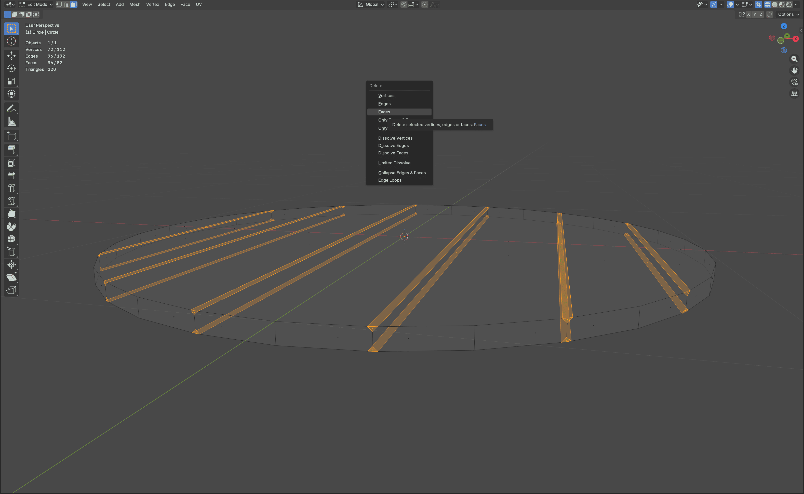</td></tr>
</table>

**Result:** Clean plank separation with beveled edges.

### 11. Separating Planks for Texturing
Select one plank section (face loop).  
Press **P** → **Selection** to separate into a new object.  
Repeat for every plank.

<table>
<tr><th width="50%">Separating by selection</th><th width="50%">Multiple separated objects in Outliner</th></tr>
<tr>
<td>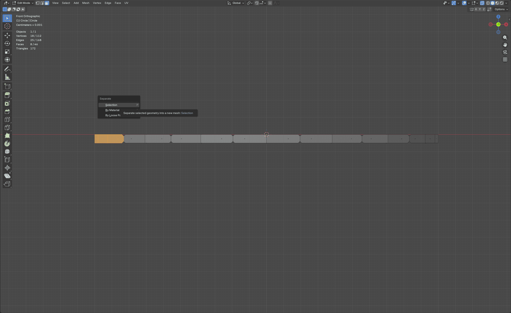</td>
<td>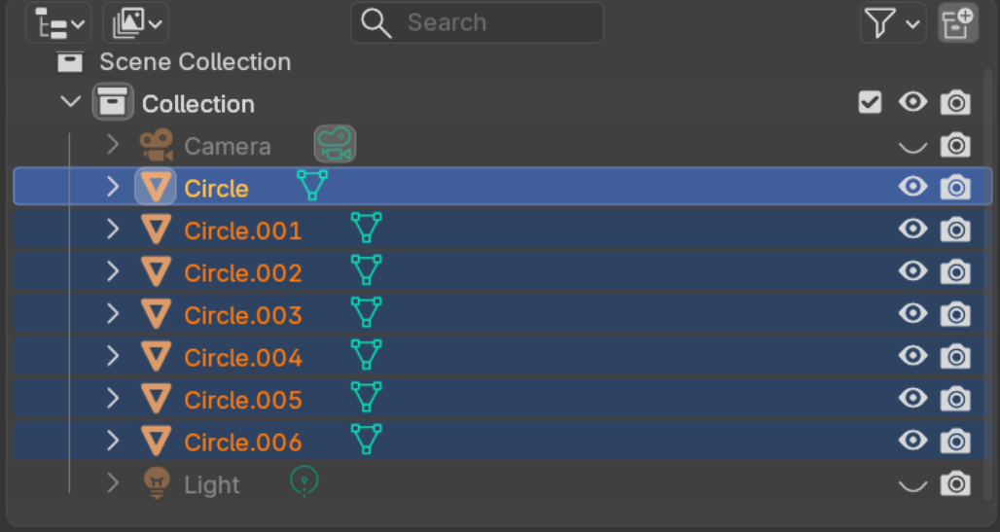</td>
</tr>
</table>

### 12. Closing Missing Edges
In **Edit Mode** (per object), select the three missing edge pairs (top, middle, bottom) one by one and press **F**.  
Do **not** select everything at once – it would create incorrect faces.

<table>
<tr><th width="100%">Connecting missing edges</th></tr>
<tr><td>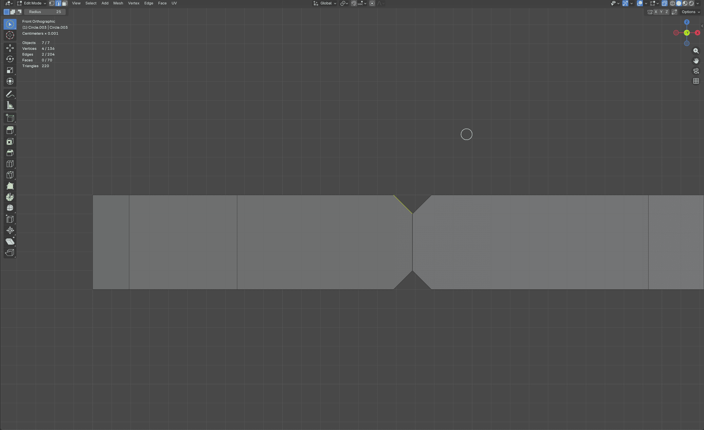</td></tr>
</table>

### 13. Creating the Wood Material
Select **one** lid object.  
In the **Material Properties** panel, click **New**.  
Rename the material to **Wood**.

<table>
<tr><th width="50%">Creating material slot</th><th width="50%">Renaming the material</th></tr>
<tr>
<td>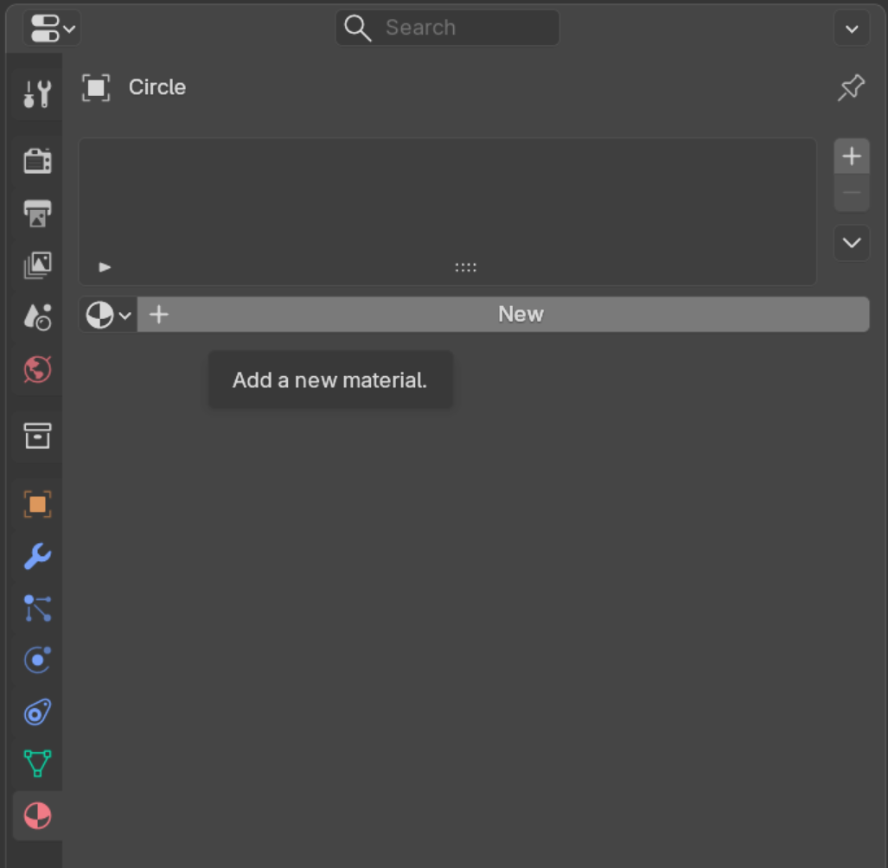</td>
<td>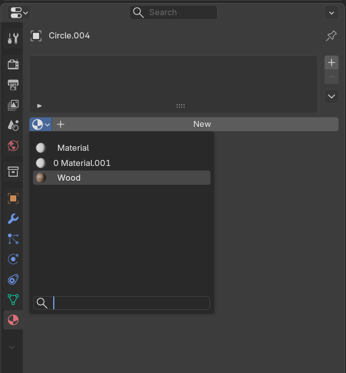</td>
</tr>
</table>

### 14. Preparing Node Wrangler Add-on
Go to **Edit** → **Preferences** → **Add-ons**.  
Search for **Node Wrangler** and enable it.

<table>
<tr><th width="100%">Enabling Node Wrangler</th></tr>
<tr><td>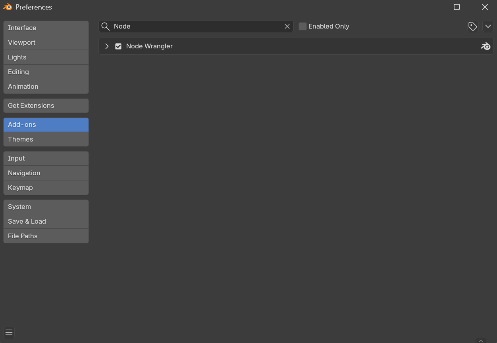</td></tr>
</table>

**Tip:** This add-on is essential for fast PBR texture setup.

### 15. Switching to Shading Workspace
Change the workspace to **Shading** (top tab).

<table>
<tr><th width="100%">Switching to Shading workspace</th></tr>
<tr><td>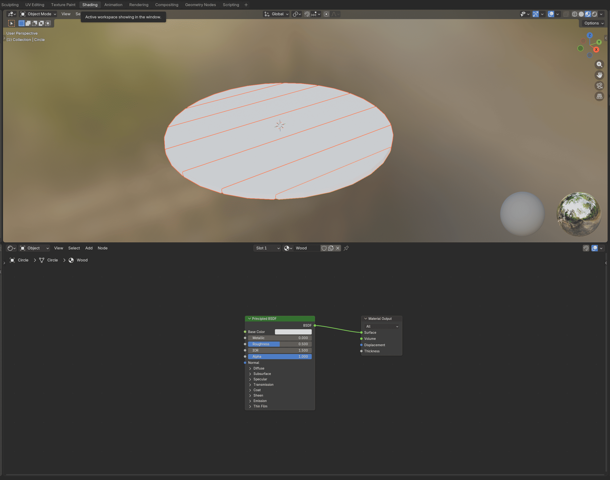</td></tr>
</table>

### 16. Importing PBR Textures
Select the **Principled BSDF** node.  
Press **Ctrl + Shift + T**.  
Navigate to the unpacked `Wood035` folder from [ambientcg.com](https://ambientcg.com/view?id=Wood035) and select all texture files.  
Click **Principled Texture Setup**.

<table>
<tr><th width="50%">Texture file selection</th><th width="50%">Automatic node setup</th></tr>
<tr>
<td>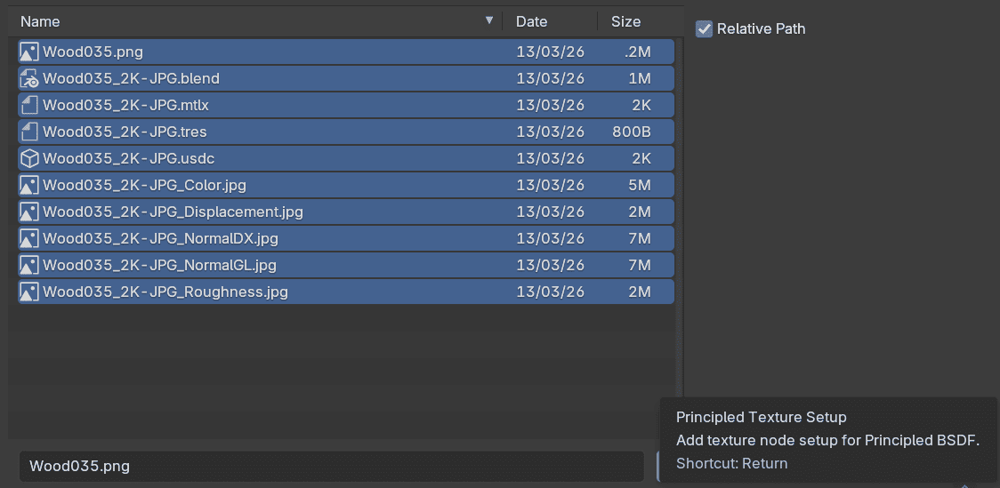</td>
<td>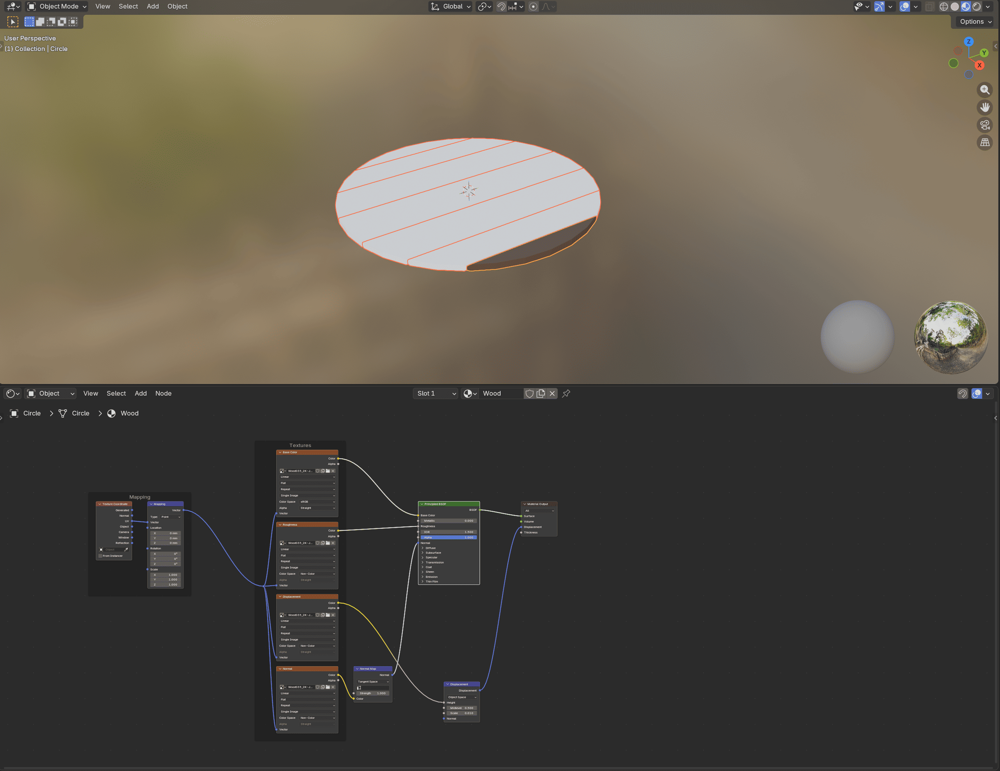</td>
</tr>
</table>

### 17. Material Application to All Objects
Now apply the material to **all** lid objects:  
1. Select **all** lid objects (keep the original object with the material as **active** – orange outline).  
2. Press **Ctrl + L** → **Link Materials**.

<table>
<tr><th width="100%">Linking materials to all objects</th></tr>
<tr><td>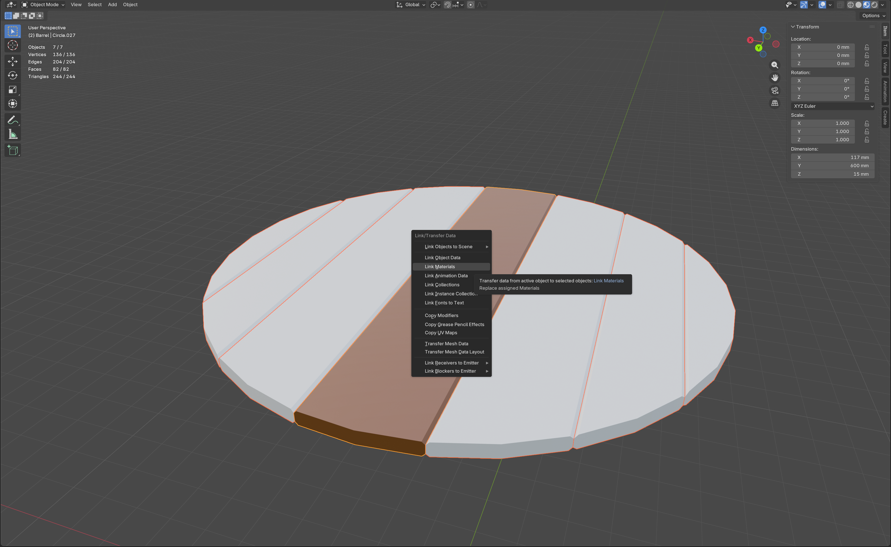</td></tr>
</table>

The lid should now appear brown (raw texture).

<table>
<tr><th width="100%">Material applied – raw preview</th></tr>
<tr><td>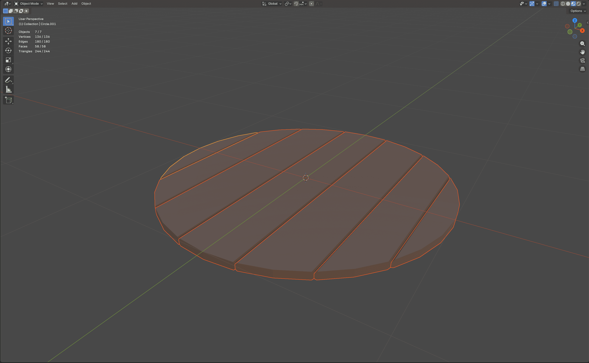</td></tr>
</table>

### 18. Fixing UV Mapping
Select all objects → **Edit Mode**.  
Right-click → **UV** → **Unwrap Faces** → **Smart UV Project**.

<table>
<tr><th width="100%">Choosing Smart UV Project</th></tr>
<tr><td>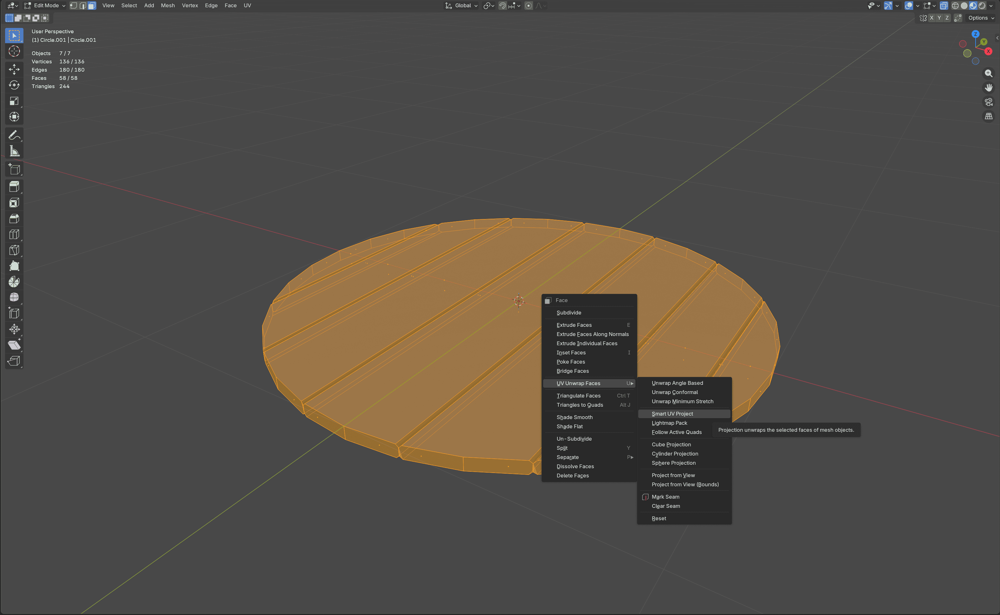</td></tr>
</table>

Recommended settings:  
- **Angle Limit**: 89°  
- **Rotation Method**: Axis-aligned (Horizontal)  
- **Margin Method**: Scaled  
- **Island Margin**: 0.000  
- **Correct Aspect**: checked

<table>
<tr><th width="100%">Smart UV Project operator panel</th></tr>
<tr><td>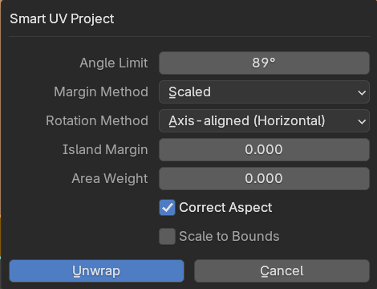</td></tr>
</table>

Click **Unwrap**.

<table>
<tr><th width="100%">Final textured lid</th></tr>
<tr><td>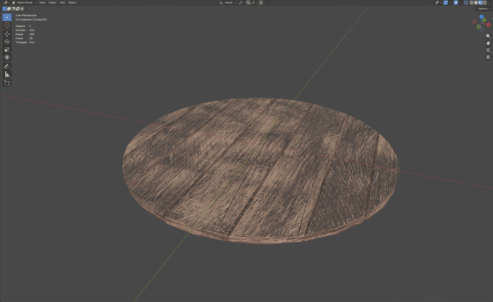</td></tr>
</table>

**Result:** Perfectly aligned wood grain.

### 19. Organizing the Project
Create a new Collection named **BarrelLid**.  
Move all lid objects into it.  
Hide the collection with the eye icon (we will use it later).

<table>
<tr><th width="100%">BarrelLid collection in Outliner</th></tr>
<tr><td>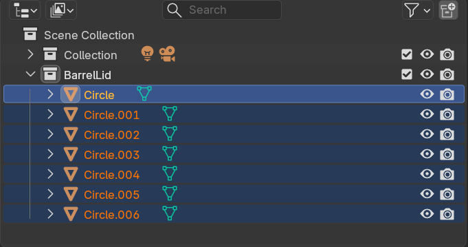</td></tr>
</table>

**Chapter complete.**  
The barrel lid is now fully modeled, separated, UV-unwrapped, and textured with high-quality PBR wood material – ready for the barrel body in the next chapter.

## Chapter 2: Creating the Barrel Body in Blender

The barrel body forms the main cylindrical container of the barrel. This chapter follows a similar workflow to the lid but extrudes vertically, adds curvature for the classic barrel shape, and applies consistent PBR texturing.

All steps were performed with **Metric** units (millimeters) for game-ready scale.

### 1. Adding the Base Circle
In **Object Mode**, press **Shift + A** → **Mesh** → **Circle**.  
This creates the circular base for the barrel body.

<table>
<tr><th width="100%">Adding the base circle for the body</th></tr>
<tr><td></td></tr>
</table>

### 2. Extruding Vertically
Enter **Edit Mode** (**Tab**).  
Switch to **Edge Select** mode (**2**).  
Press **A** to select all edges.  
Press **E** to extrude and drag upward (or type the desired height) to form the basic cylinder.

<table>
<tr><th width="100%">Extruding the circle vertically</th></tr>
<tr><td>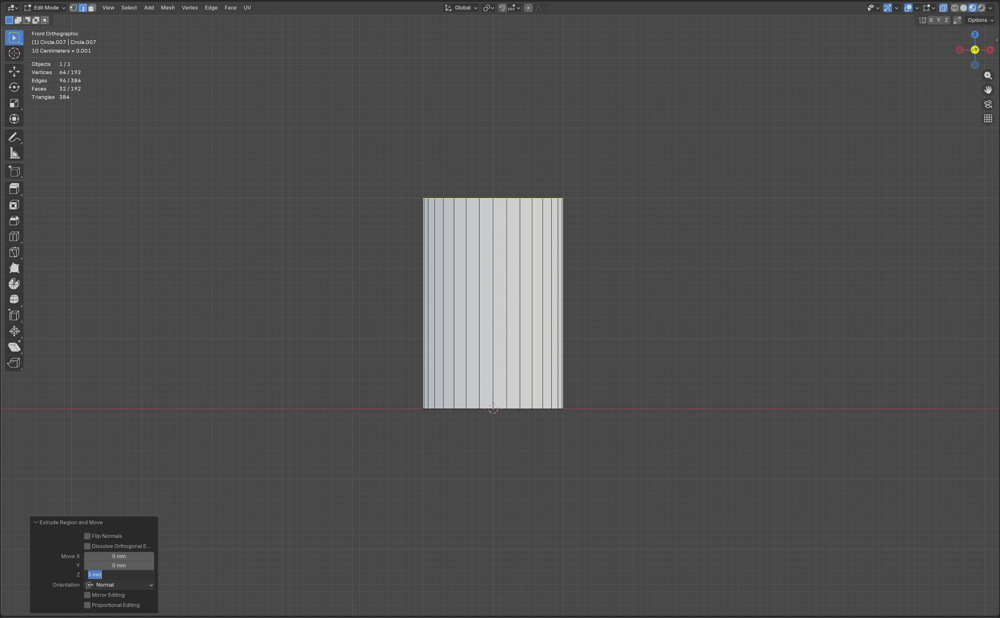</td></tr>
</table>

### 3. Adding Thickness with Solidify
In **Object Mode**, add the **Solidify** modifier.  
Set **Thickness** to your desired wall thickness (e.g., 5 mm).  
Apply the modifier in **Object Mode**.

<table>
<tr><th width="100%">Solidify modifier applied to the body</th></tr>
<tr><td>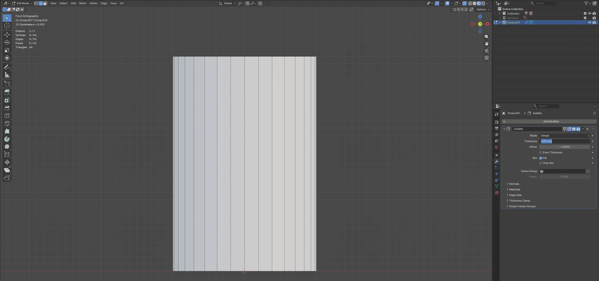</td></tr>
</table>

### 4. Adding Bevel Detail to Planks
Switch to **Edit Mode** and **Edge Select** mode.  
Select every second vertical edge loop (both outer and inner).  
Press **Ctrl + B** to bevel and adjust width/segments as with the lid.

<table>
<tr><th width="100%">Beveling selected edges on the body</th></tr>
<tr><td>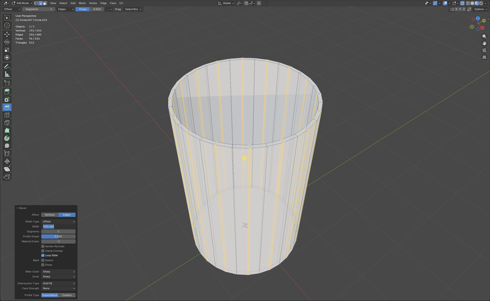</td></tr>
</table>

### 5. Removing Inner Faces from Bevel
Switch to **Face Select** mode (**3**).  
Select all newly created inner faces from the bevel.  
Press **X** → **Faces** to delete them.

<table>
<tr><th width="100%">Deleting inner bevel faces</th></tr>
<tr><td>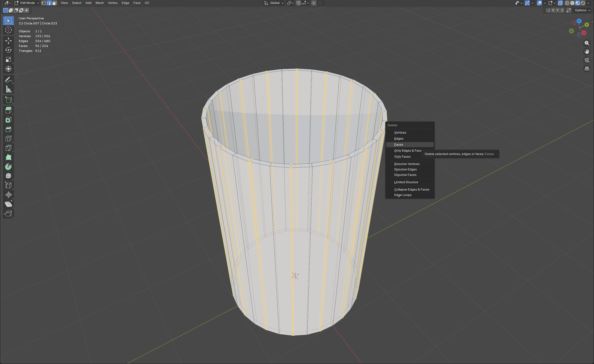</td></tr>
</table>

### 6. Separating Plank Sections
Select one vertical plank section (face loop).  
Press **P** → **Selection** to separate into a new object.  
Repeat for all planks.

<table>
<tr><th width="100%">Separating body planks</th></tr>
<tr><td>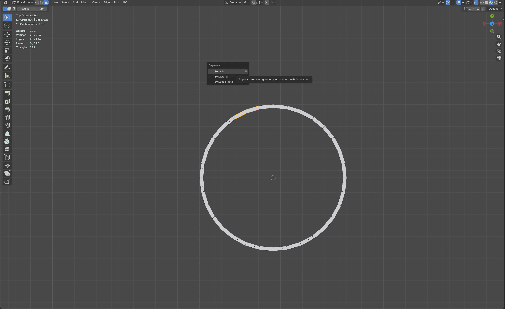</td></tr>
</table>

### 7. Organizing into Collection
Create a new Collection named **BarrelBody**.  
Move all separated plank objects into it.

<table>
<tr><th width="100%">BarrelBody collection in Outliner</th></tr>
<tr><td>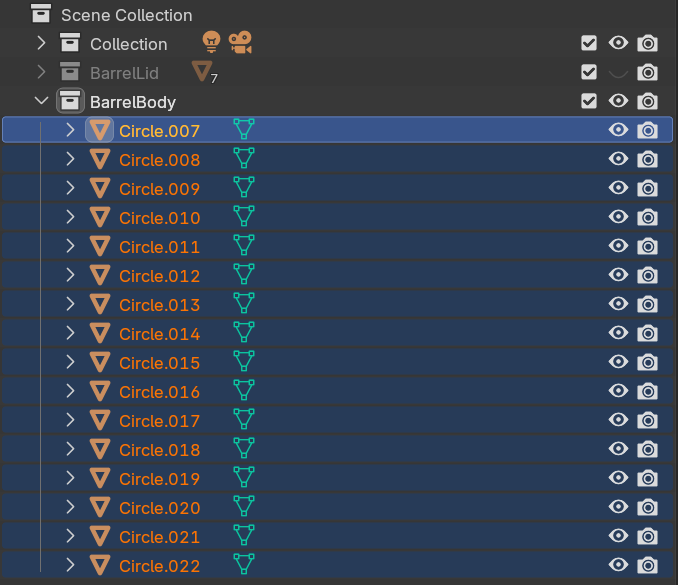</td></tr>
</table>

### 8. Closing Missing Edges
In **Edit Mode** for each plank, select the three missing edge pairs (top, middle, bottom) one by one.  
Press **F** to create each edge.  
Repeat for all planks.

<table>
<tr><th width="100%">Connecting missing edges</th></tr>
<tr><td>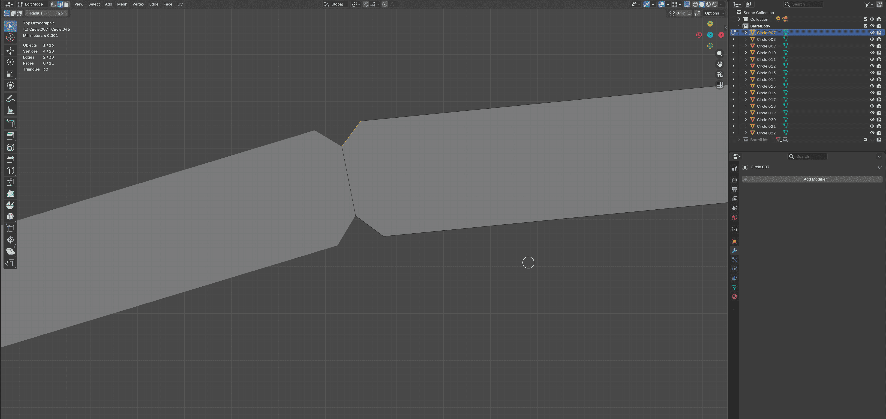</td></tr>
</table>
<table>

### 9. Applying the Wood Material
Select one plank and ensure it has the **Wood** material.

<table>
<tr><th width="100%">Adding wood Material</th></tr>
<tr><td>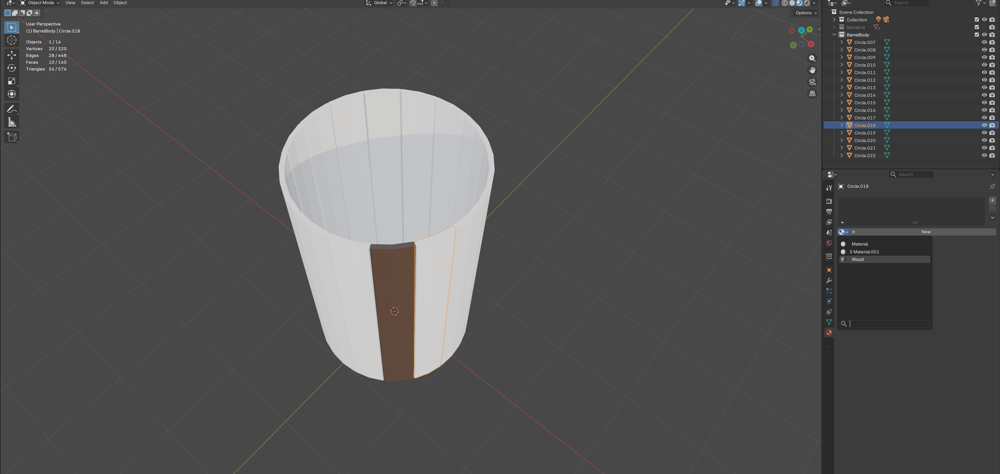</td></tr>
</table>
<table>

Select **all** body objects (keep the material object active – orange outline).  
Press **Ctrl + L** → **Link Materials**.

<table>
<tr><th width="50%">Selecting all body objects</th><th width="50%">Link Materials menu</th></tr>
<tr>
<td>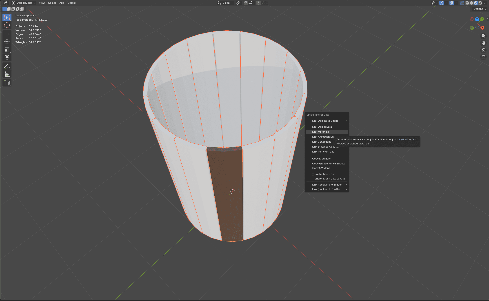</td>
<td>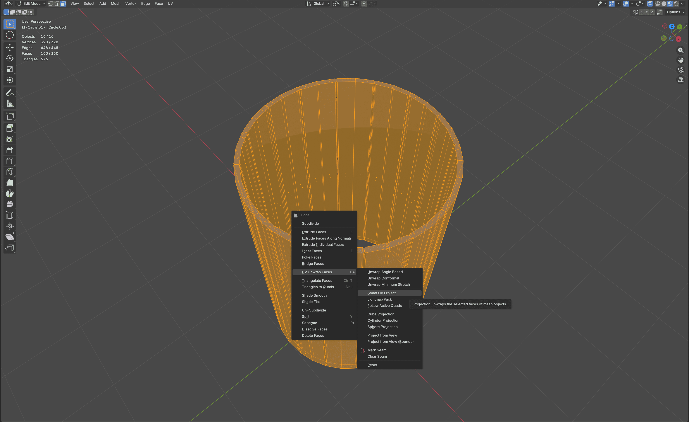</td>
</tr>
</table>

### 10. Initial UV Unwrapping
Select all body objects → **Edit Mode**.  
Press **A** to select all faces.  
Right-click → **UV** → **Unwrap Faces** → **Smart UV Project**.

<table>
<tr><th width="50%">UV Unwrapped body</th><th width="50%">Smart UV Project on body</th></tr>
<tr>
<td>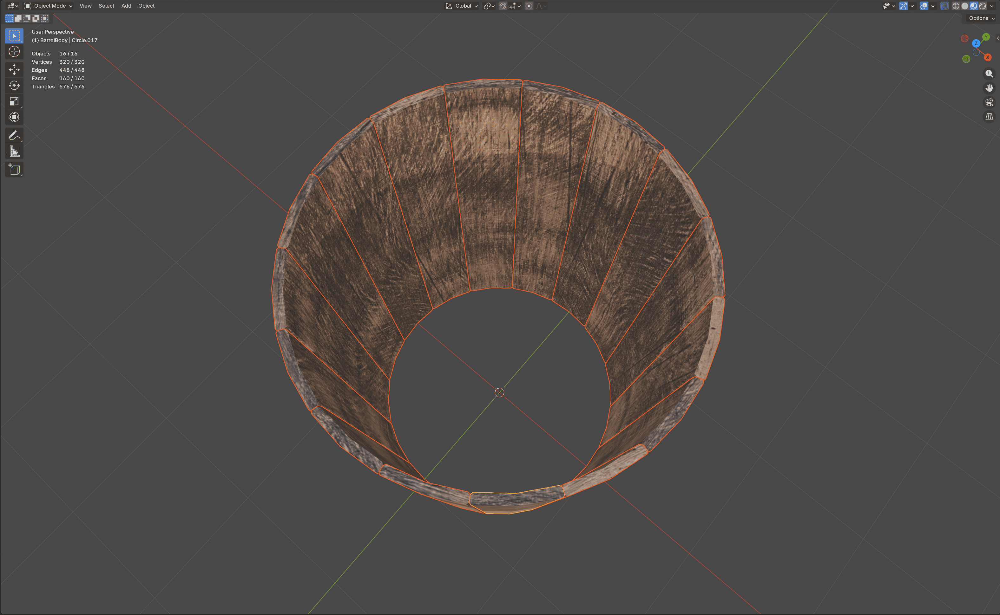</td>
<td>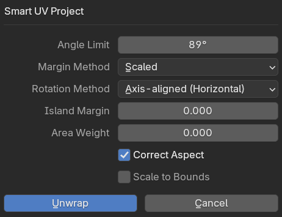</td>
</tr>
</table>

### 11. Fixing Top & Bottom UV Orientation
Select only the top and bottom ring faces.  
Re-unwrap using **Smart UV Project** but set **Rotation Method** to **Axis-aligned (Vertical)**.

<table>
<tr><th width="50%">Selecting Top and Bottom Faces</th><th width="50%">Vertical UV result</th></tr>
<tr>
<td>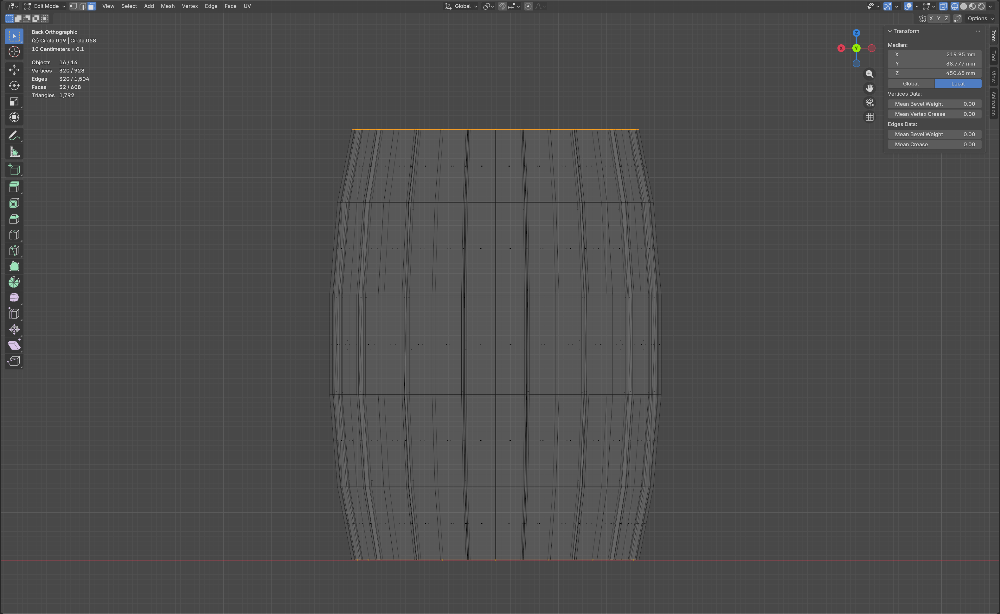</td>
<td>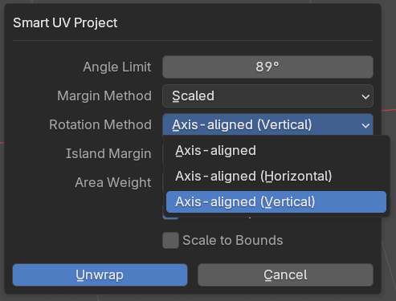</td>
</tr>
</table>

**Result:** Wood grain now aligns correctly on top/bottom rings.

<table>
<tr><th width="100%">Improved UV appearance</th></tr>
<tr><td>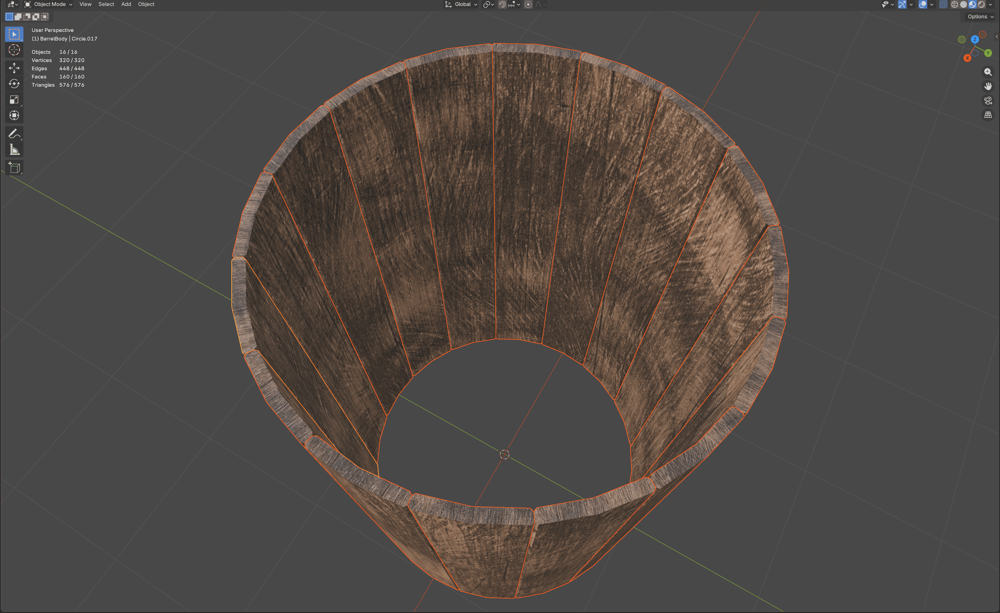</td></tr>
</table>

### 12. Adding Horizontal Subdivision for Curvature
Select all body objects → **Edit Mode**.  
Right-click → **Subdivide**.  

<table>
<tr><th width="100%">Subdividing for horizontal loops</th></tr>
<tr><td>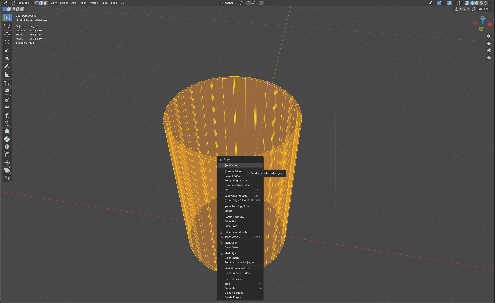</td></tr>
</table>

Set **Number of Cuts** to 4 (creates 4 horizontal edge loops).

<table>
<tr><th width="100%">Applied subdivision</th></tr>
<tr><td>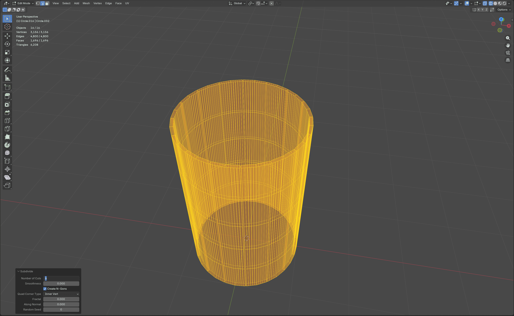</td></tr>
</table>

### 13. Scaling Loops for Barrel Shape
Select the horizontal edge loops.  
Press **S** to scale them inward/outward to create the classic barrel bulge.  

<table>
<tr><th width="100%">Scaling all loops</th></tr>
<tr><td>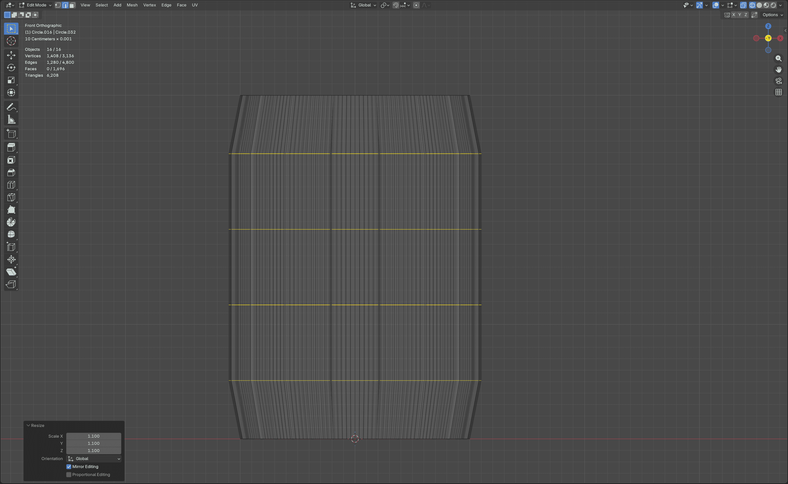</td></tr>
</table>

Repeat on inner loops for smoother curvature.

<table>
<tr><th width="100%">Scaling middle loops</th></tr>
<tr><td>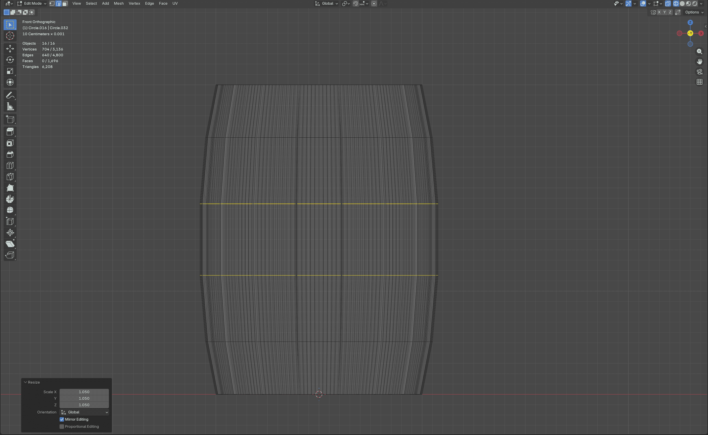</td></tr>
</table>

**Result:** The body now has a realistic convex barrel shape.

<table>
<tr><th width="100%">Final barrel curvature</th></tr>
<tr><td>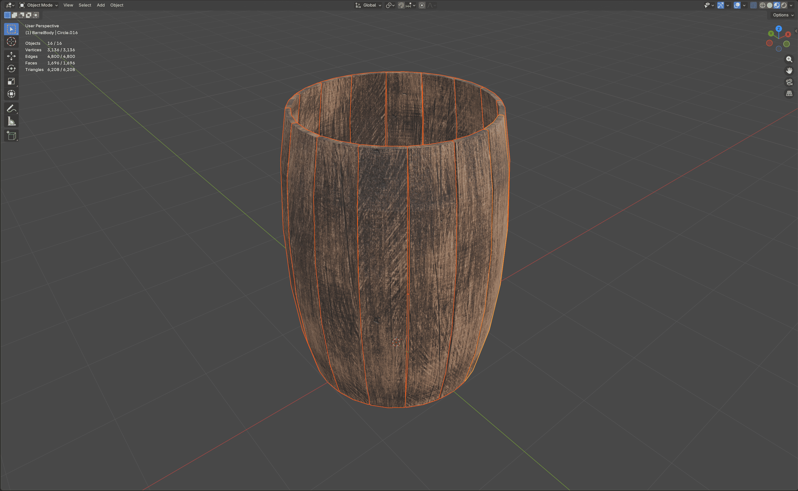</td></tr>
</table>

### 14. Positioning the Bottom Lid
Show the **BarrelLid** collection.  
Select the bottom lid objects.  
Move them upward along Z-axis to align with the body bottom.

<table>
<tr><th width="100%">Positioning bottom lid on body</th></tr>
<tr><td>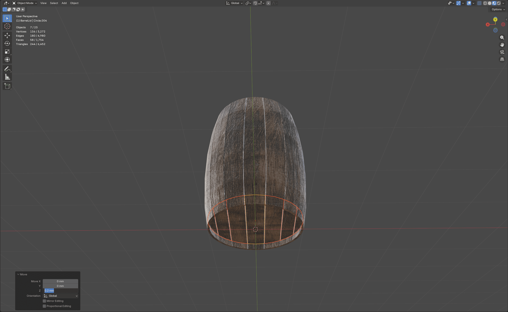</td></tr>
</table>

### 15. Duplicating Lid for Top Closure
Select the bottom lid objects.  
Press **Shift + D** to duplicate.  
Move the copy upward along Z-axis to close the top.

<table>
<tr><th width="100%">Duplicating and positioning top lid</th></tr>
<tr><td>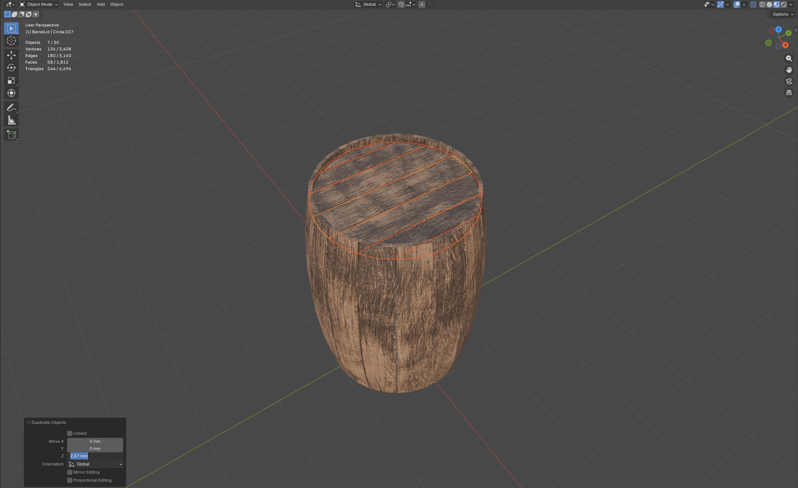</td></tr>
</table>

### 16. Final Organization
Create sub-collections if needed (e.g., **BarrelLidBottom** and **BarrelLidTop**).  
Move the corresponding lid objects into them for clarity.

<table>
<tr><th width="100%">Organized collections with lids and body</th></tr>
<tr><td>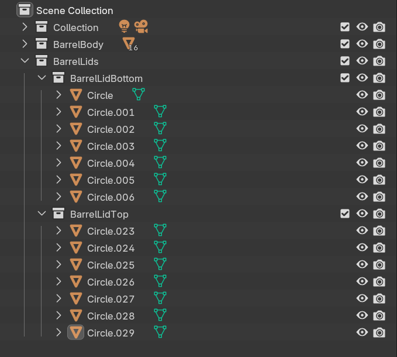</td></tr>
</table>

**Chapter complete.**  
The barrel body is now modeled with realistic curvature, separated planks, proper UV mapping, and consistent wood texturing. Both lids are positioned, completing the basic barrel assembly – ready for metal hoops or final refinements in the next chapter.

## Chapter 3: Creating the Metal Hoops in Blender

The metal hoops (bands) give the barrel its classic reinforced look and hold the wooden staves together. This chapter creates simple extruded rings, adds thickness, duplicates them around the barrel, and applies a realistic PBR steel material with proper UV projection.

All steps were performed with **Metric** units (millimeters) for game-ready scale.

### 1. Adding the Base Circle for the Hoop
In **Object Mode**, press **Shift + A** → **Mesh** → **Circle**.  
Position it around the barrel at the desired height (e.g., lower band).

<table>
<tr><th width="100%">Adding the base circle for the first hoop</th></tr>
<tr><td>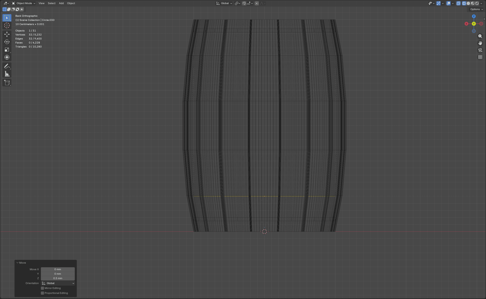</td></tr>
</table>

### 2. Resizing the Hoop Diameter
With the circle selected, press **S** to scale it until it fits snugly around the barrel body at that height.

<table>
<tr><th width="100%">Scaling the circle to fit the barrel</th></tr>
<tr><td>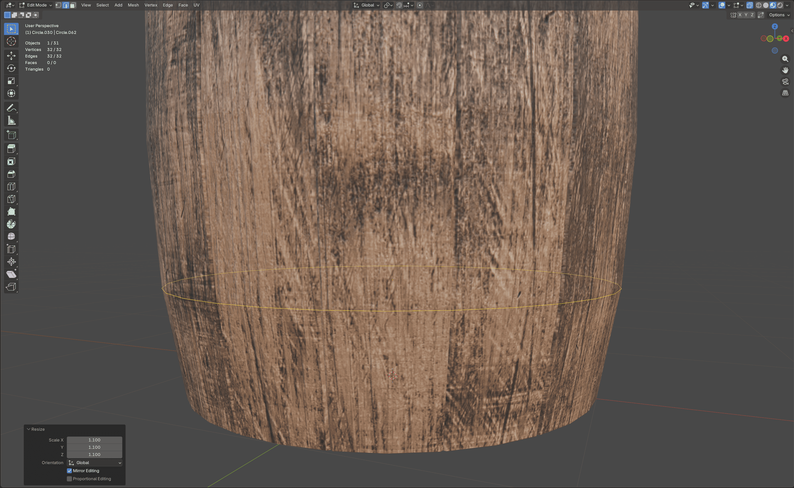</td></tr>
</table>

### 3. Extruding the Hoop Width
Enter **Edit Mode** (**Tab**).  
Switch to **Edge Select** mode (**2**).  
Select the outer edge loop.  
Press **E** to extrude outward and create the basic width of the hoop.

<table>
<tr><th width="100%">Extruding the hoop width</th></tr>
<tr><td>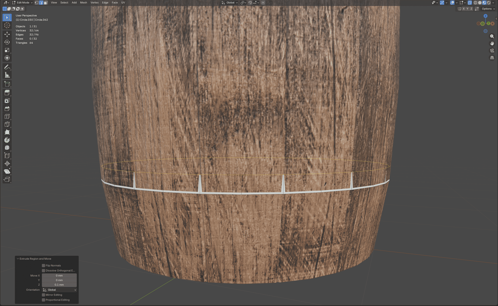</td></tr>
</table>

### 4. Tapering the Top Edge
Still in **Edit Mode**, select the top edge loop of the extruded ring.  
Press **S** to scale it slightly outward so the hoop tapers and follows the barrel's curve more naturally.

<table>
<tr><th width="100%">Scaling the top edge for taper</th></tr>
<tr><td>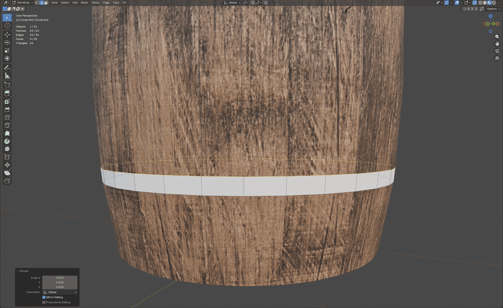</td></tr>
</table>

### 5. Adding Thickness with Solidify
Exit to **Object Mode**.  
Add the **Solidify** modifier.  
Set **Offset** to **1** (extrudes outward) and choose a realistic **Thickness** (e.g., 2–5 mm).  
Apply the modifier.

<table>
<tr><th width="100%">Solidify modifier – outward thickness</th></tr>
<tr><td>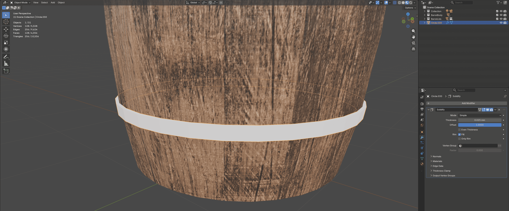</td></tr>
</table>

### 6. Duplicating for Additional Hoops
Select the finished hoop.  
Press **Shift + D** to duplicate.  
Move the copy upward (G → Z) to the next desired position (middle or upper band).

<table>
<tr><th width="100%">Duplicating and positioning the next hoop</th></tr>
<tr><td>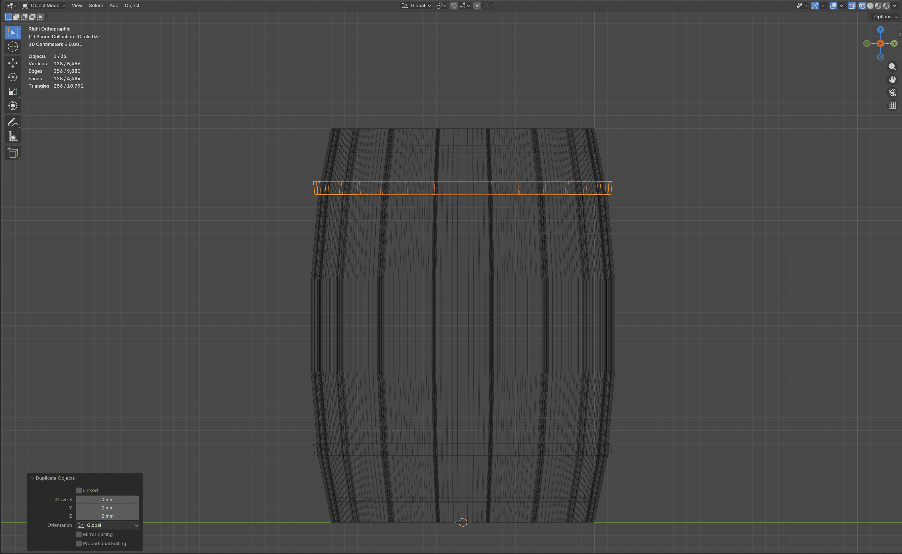</td></tr>
</table>

### 7. Rotating the Duplicate 180° (Optional Flip)
With the duplicated hoop selected, press **R** → **Y** → **180** to flip it 180° on the Y-axis (useful if the bevel direction needs to match the barrel curve symmetrically).

<table>
<tr><th width="100%">Rotating duplicate hoop 180° on Y-axis</th></tr>
<tr><td>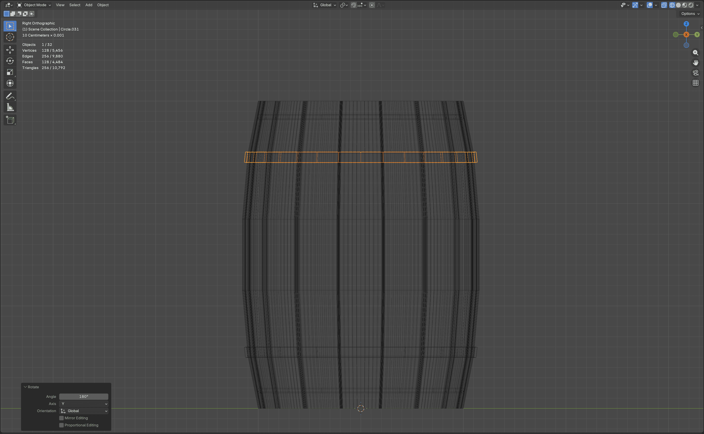</td></tr>
</table>

### 8. Creating Middle Hoops
Repeat the duplication, scaling, and minor edge adjustment process for the two middle hoops.  
Fine-tune their top/bottom edges with **S** so they sit flush against the curved staves.

<table>
<tr><th width="100%">Adjusting middle hoops to fit barrel curve</th></tr>
<tr><td>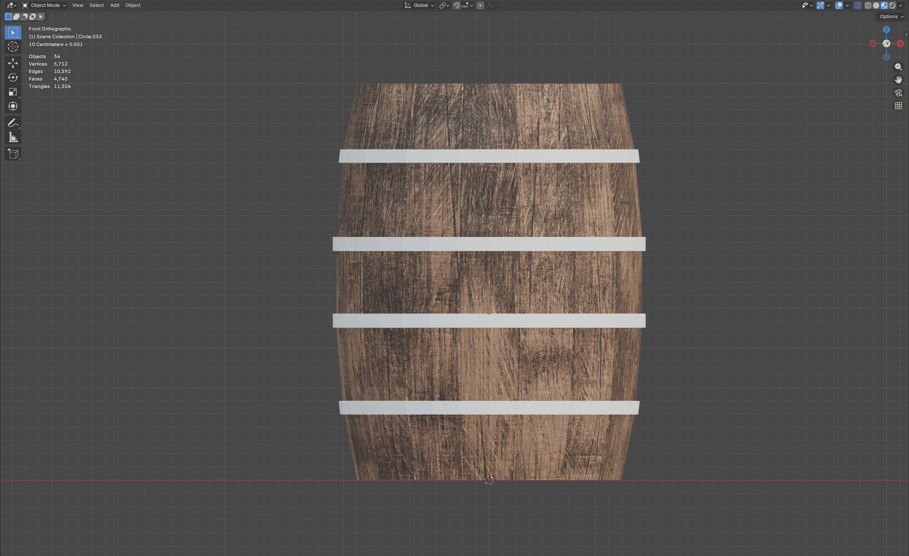</td></tr>
</table>

### 9. Creating the Steel Material
Select one hoop object.  
In the **Material Properties** panel, click **New** and name it **Steel**.

<table>
<tr><th width="100%">Creating new Steel material slot</th></tr>
<tr><td>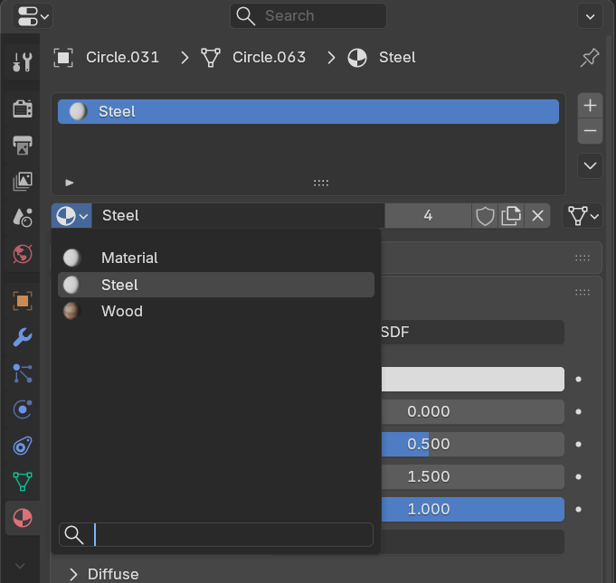</td></tr>
</table>

### 10. Importing PBR Steel Textures
Switch to the **Shading** workspace.  
Select the **Principled BSDF** node.  
Press **Ctrl + Shift + T**.  
Navigate to the unpacked `Metal052C` folder from [ambientcg.com](https://ambientcg.com/view?id=Metal052C) and select all texture files.  
Click **Principled Texture Setup**.

<table>
<tr><th width="50%">Selecting Metal052C texture files</th><th width="50%">Automatic Principled Texture Setup</th></tr>
<tr>
<td>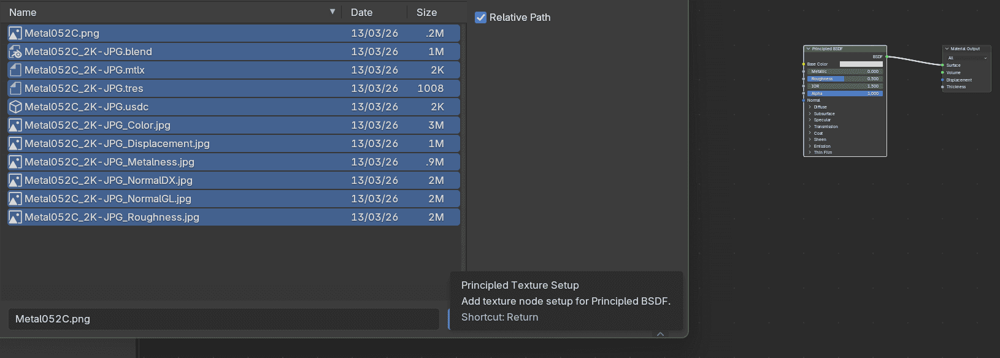</td>
<td>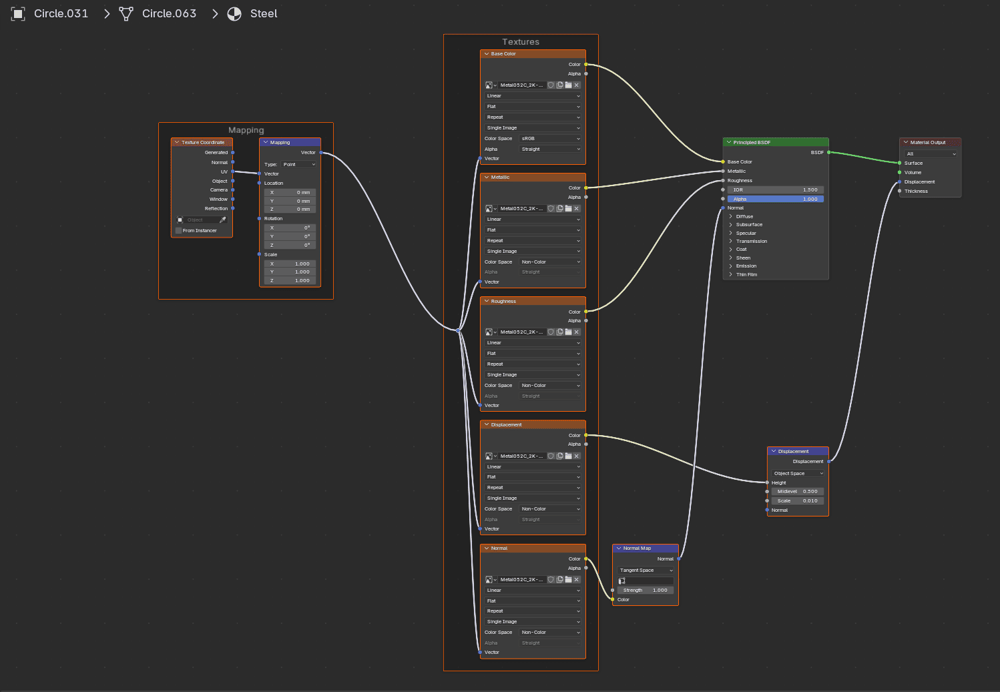</td>
</tr>
</table>

### 11. Linking Steel Material to All Hoops
Select **all** hoop objects (keep the one with the Steel material as active – orange outline).  
Press **Ctrl + L** → **Link Materials**.

<table>
<tr><th width="100%">Linking Steel material to all hoops</th></tr>
<tr><td>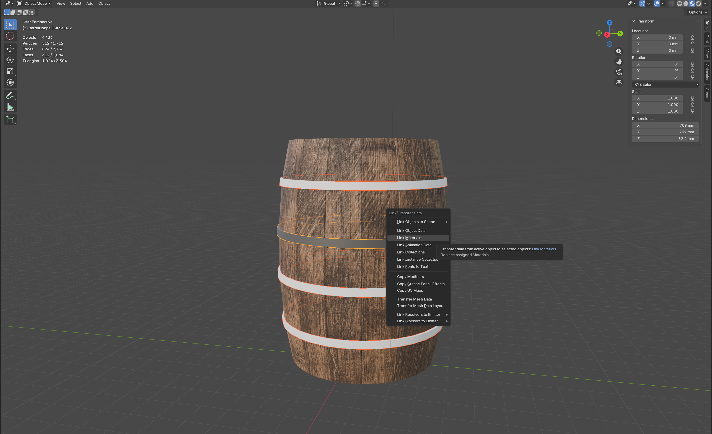</td></tr>
</table>

### 12. UV Unwrapping the Hoops
Select all hoop objects → **Edit Mode**.  
Switch to **Face Select** mode (**3**).  
Press **A** to select all faces.  
Right-click → **UV** → **Unwrap Faces** → **Cube Projection** (gives clean results on ring geometry).

<table>
<tr><th width="50%">Cube Projection UV unwrap for hoops</th><th width="50%">Final textured hoops</th></tr>
<tr>
<td>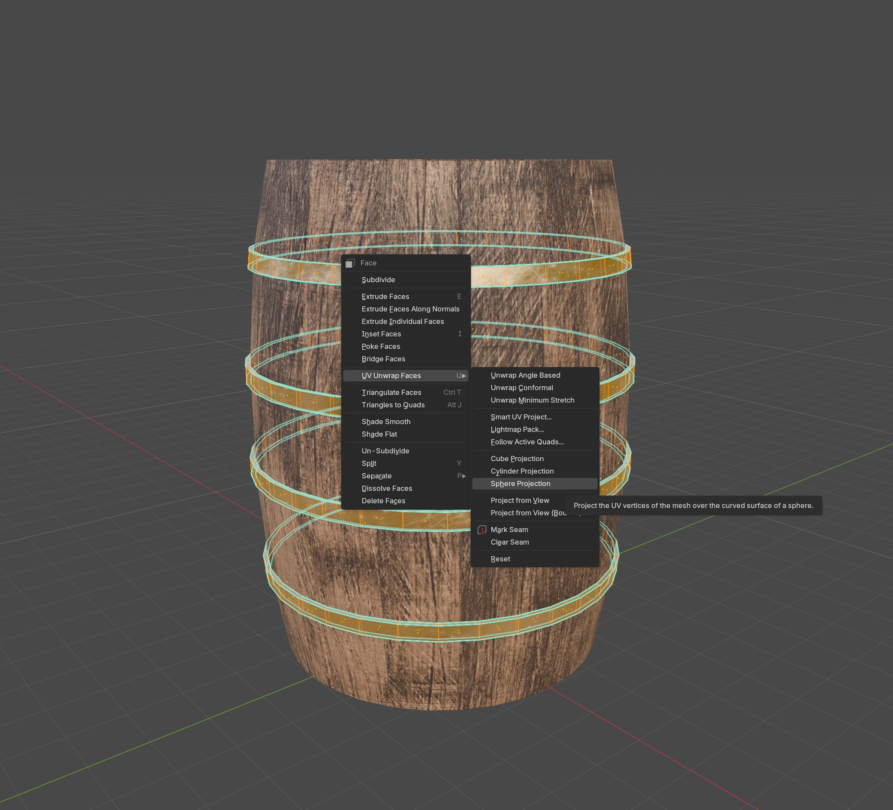</td>
<td>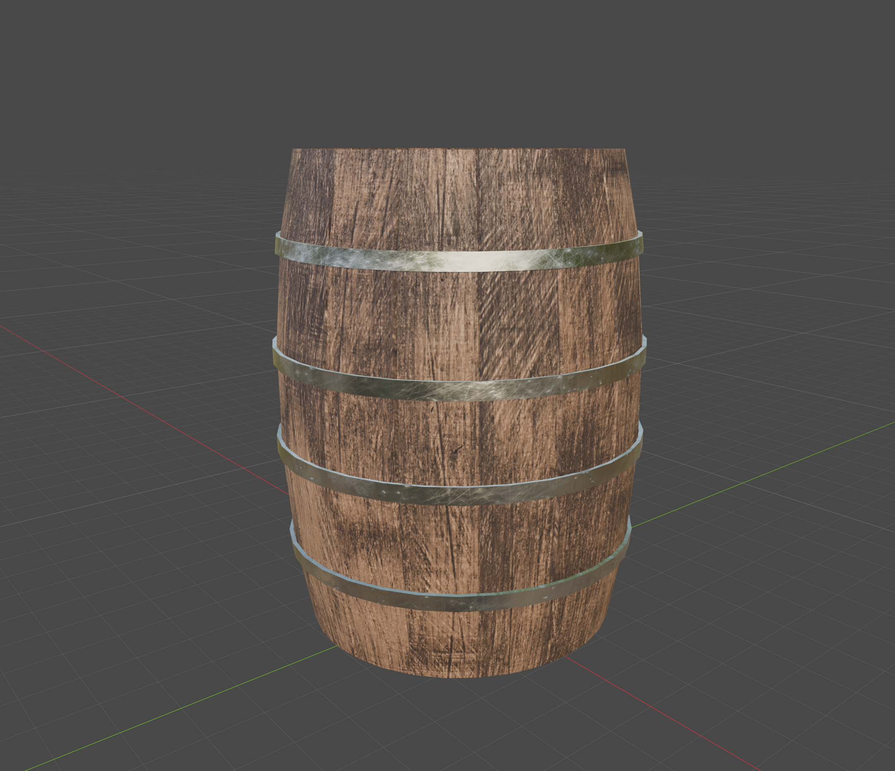</td>
</tr>
</table>

**Result:** Perfectly aligned Metal grain.

### 13. Final Organization
Create a new Collection named **BarrelHoops**.  
Move all hoop objects into it.  
Hide/show collections as needed to keep the Outliner clean.

<table>
<tr><th width="100%">BarrelHoops collection in Outliner</th></tr>
<tr><td>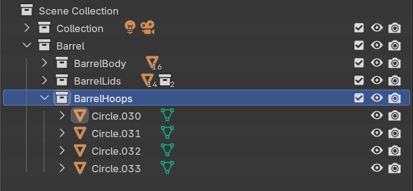</td></tr>
</table>

**Chapter complete.**  
The metal hoops are now modeled, textured with high-quality PBR steel, UV unwrapped using Cube Projection, and organized in the scene. The barrel now has its iconic banded appearance – ready for final assembly tweaks, lighting, or export in the next steps.

## Chapter 4: Final Optimization, Shading, and Export in Blender

This final chapter optimizes the barrel model for performance (reducing polygon count while preserving visual quality), applies smooth shading, corrects scale for game engines, and exports it as an FBX file ready for Unity, Unreal, or similar.

All steps were performed with **Metric** units (millimeters) for game-ready scale.

### 1. Applying Shade Auto Smooth
Select everything (**A**).  
Right-click → **Shade Auto Smooth**.  
This automatically smooths normals based on edge angles, giving the barrel a polished look without extra geometry.

<table>
<tr><th width="50%">Applying Shade Auto Smooth to all objects</th><th width="50%">Result after Shade Auto Smooth</th></tr>
<tr>
<td>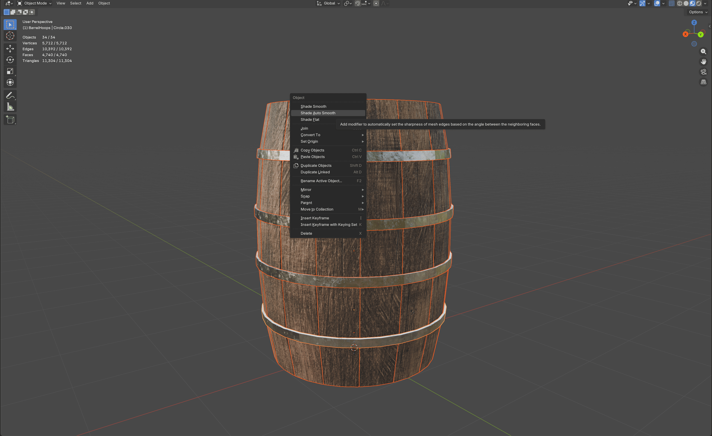</td>
<td>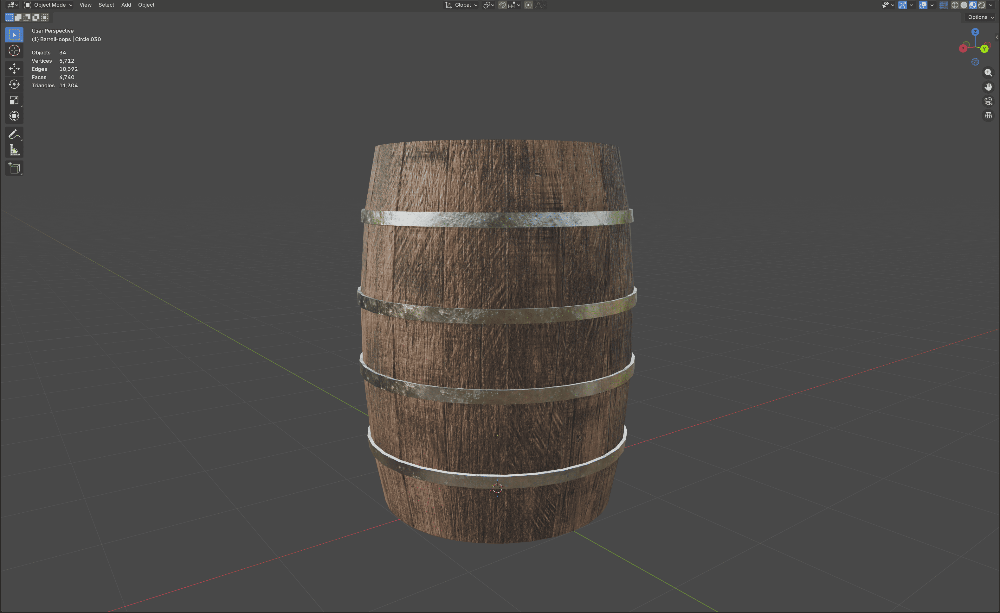</td>
</tr>
</table>

### 2. Setting Origin to Geometry
Select all objects (**A**).  
Right-click → **Set Origin** → **Origin to Geometry**.  
This centers the origin point of each object on its own geometry, which is essential for correct scaling, rotation, and export.

<table>
<tr><th width="100%">Setting origin to geometry on all objects</th></tr>
<tr><td>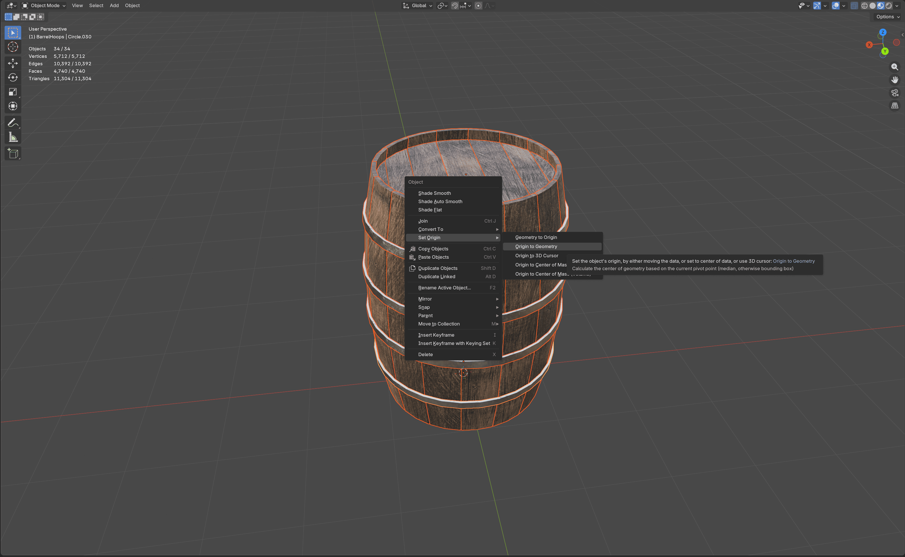</td></tr>
</table>

### 3. Reducing Polygon Count with Limited Dissolve
Select all objects (**A**).  
Go to **Mesh** → **Clean Up** → **Limited Dissolve**.

<table>
<tr><th width="100%">Applying Limited Dissolve</th></tr>
<tr><td>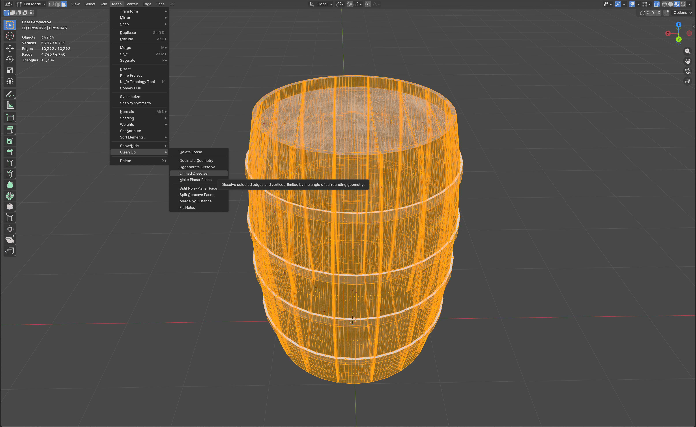</td></tr>
</table>

In the operator panel (bottom-left), set **Max Angle** to around **4.5° – 5°**.  
This removes unnecessary flat faces while keeping the shape intact.

<table>
<tr><th width="100%">Applied Limited Dissolve (Angle ~4.5°)</th></tr>
<tr><td>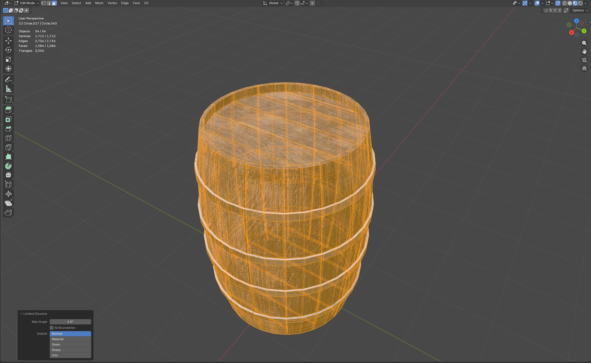</td></tr>
</table>

**Result:** Significant optimization achieved.  
Original stats (before): Vertices ~5,712 | Faces ~4,740 | Triangles ~11,304  
After Limited Dissolve: Vertices ~1,712 | Faces ~1,084 | Triangles ~3,304  
Visual quality remains nearly identical – perfect for game assets.

<table>
<tr><th width="100%">Optimized barrel after Limited Dissolve</th></tr>
<tr><td>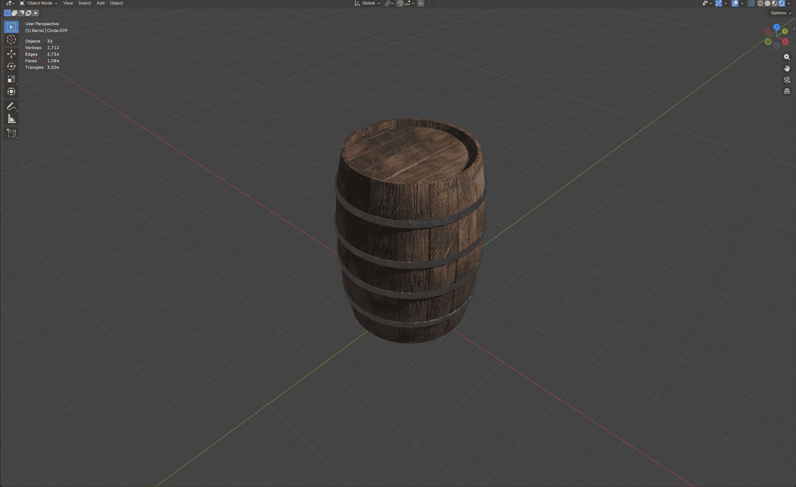</td></tr>
</table>

### 4. Checking Final Dimensions
Select the main barrel assembly.  
Press **N** to open the **Item** panel.  
Verify **Dimensions** (should be approximately: Height ~900 mm, Diameter ~600 mm).  
If too large/small, select all (**A**) and scale uniformly (**S**) until correct.

<table>
<tr><th width="100%">Checking barrel dimensions in Item panel</th></tr>
<tr><td>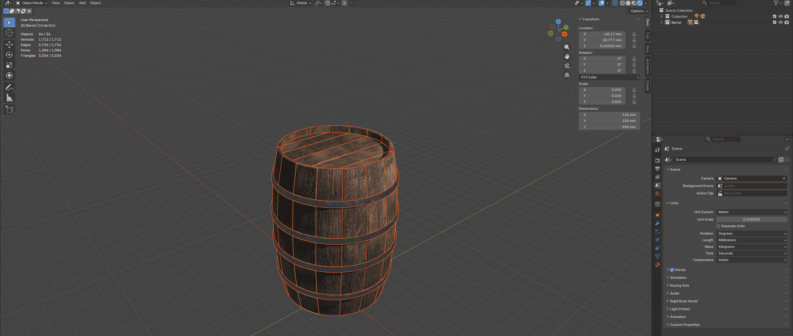</td></tr>
</table>

### 5. Applying All Transforms
Select everything (**A**).  
Press **Ctrl + A** → **All Transforms**.  
This bakes location, rotation, and scale into the mesh data – crucial for consistent import into game engines.

<table>
<tr><th width="100%">Applying All Transforms</th></tr>
<tr><td>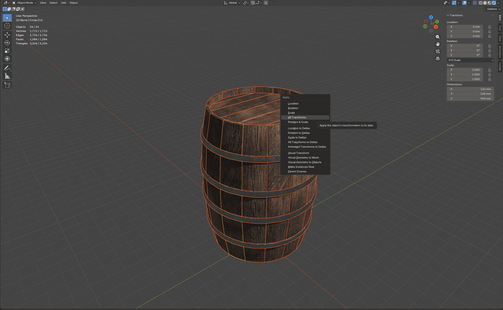</td></tr>
</table>

### 6. Exporting as FBX
Right-click → on the Barrel Collection → **Select Objects**.  
Go to **File** → **Export** → **FBX (.fbx)**.  
In the export sidebar use these recommended settings for game engines:

- **Include** → **Selected Objects** checked, **Object Types** → **Mesh**  
- **Transform** → **Scale: 1.00**, **Apply Unit** checked, **Apply Transform** checked  
- **Geometry** → **Apply Modifiers** checked, **Smoothing: Normals Only**

Name the file (e.g., Barrel.fbx) and export.

<table>
<tr><th width="50%">FBX export</th><th width="50%">FBX export settings panel</th></tr>
<tr>
<td>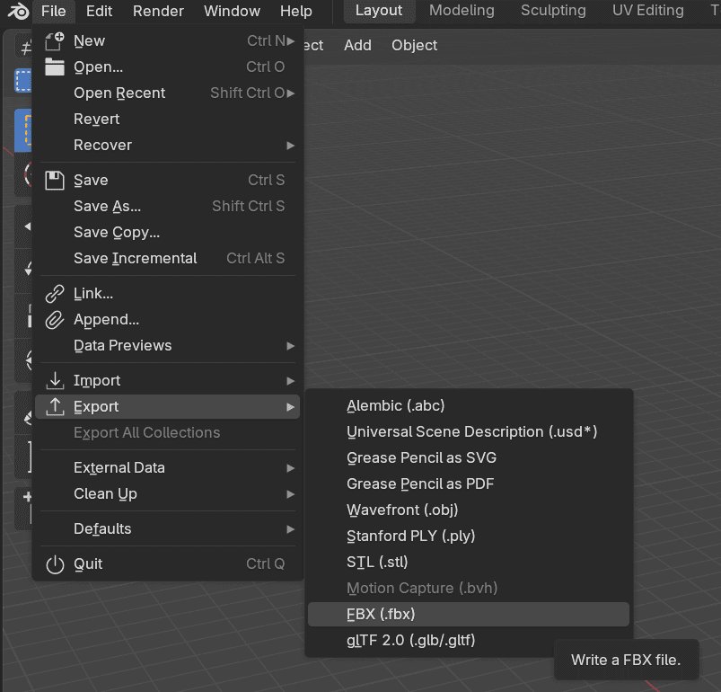</td>
<td>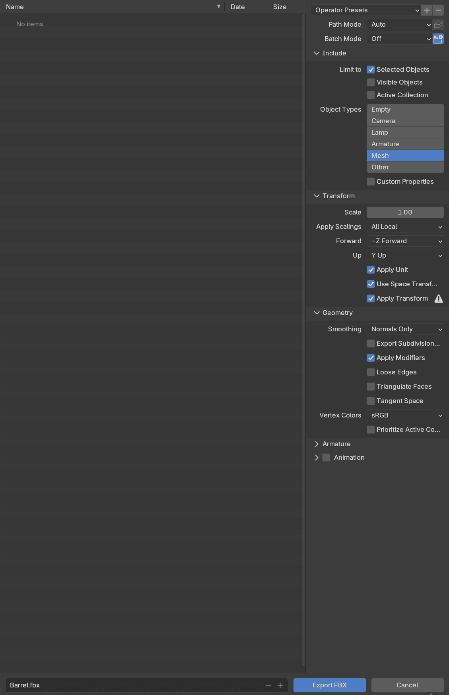</td>
</tr>
</table>

**Chapter complete.**  
The barrel is fully modeled, textured (wood + steel), optimized (~70% polygon reduction), smoothed, scaled correctly, and exported as FBX. It is now ready for import into Unity, Unreal Engine, Godot, or any other game engine.

**Documentation end.**  
All chapters are now complete. The full barrel model is production-ready with clean topology, PBR materials, and optimized performance.
