# 3D Modeling in Games - Model Import & Testing Documentation

## Chapter 5: Importing and Testing the Barrel Model in Unity 

This chapter focuses on importing the Dust3D-created barrel into Unity, fixing import-specific issues (transparency, broken UVs), setting up physics, comparing it with the Blender version, and evaluating real-time performance and limitations. The goal is to verify how the automatically merged single-mesh model behaves in a game engine.

### 1. Importing the Model
Drag and drop the `Dust3D_Barrel.fbx` file directly into the **Assets > Models** folder.

<table>
<tr><th width="100%">Importing the Dust3D FBX model</th></tr>
<tr><td>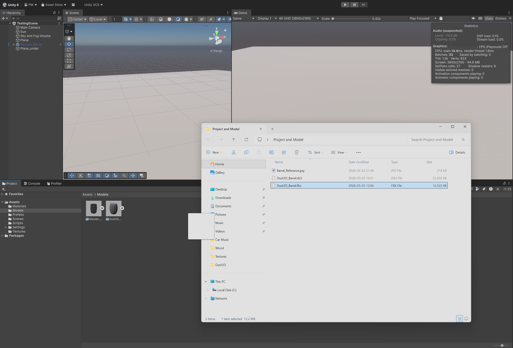</td></tr>
</table>

### 2. Extracting Textures and Materials
Select the imported model and go to the **Materials** tab. Extract textures and materials into the correct project folders (`Textures` and `Materials`).

<table>
<tr><th width="50%">Extracted textures folder</th><th width="50%">Extracted materials folder</th></tr>
<tr>
<td>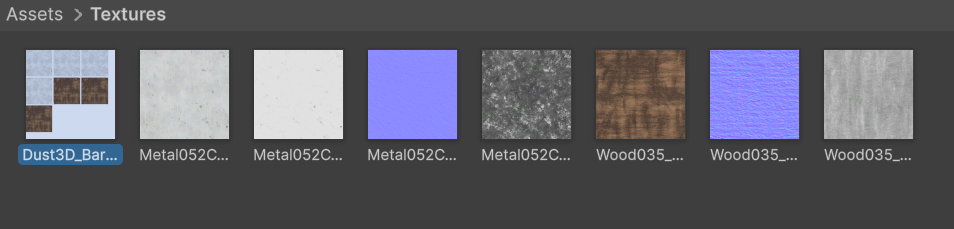</td>
<td>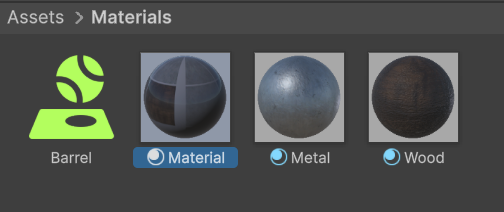</td>
</tr>
</table>

### 3. Placing the Model in the Scene
Drag the barrel into the scene, reset its position, and rotate it **Z = 90°** so it lies horizontally like a real barrel.

<table>
<tr><th width="100%">Model placed and rotated on the scene</th></tr>
<tr><td>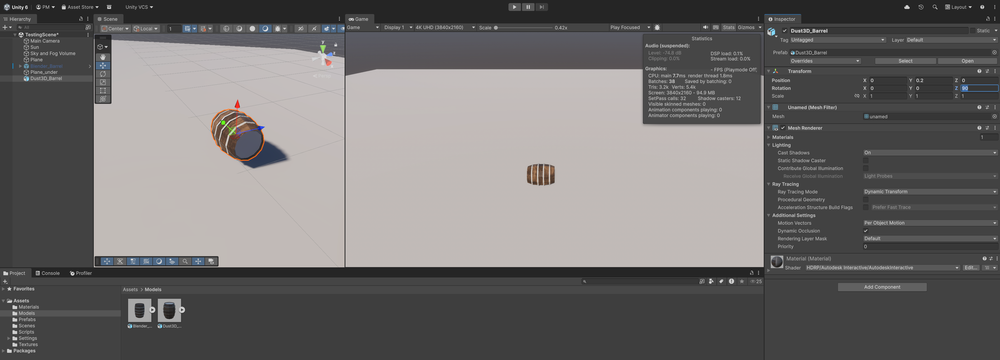</td></tr>
</table>

### 4. Fixing Transparency
The barrel appears transparent right after import because Dust3D embeds materials differently. Select the extracted material and change **Surface Type** from Transparent to **Opaque**.

<table>
<tr><th width="33%">Transparent barrel after import</th><th width="33%">Surface Type setting</th><th width="33%">Opaque barrel after fix</th></tr>
<tr>
<td></td>
<td>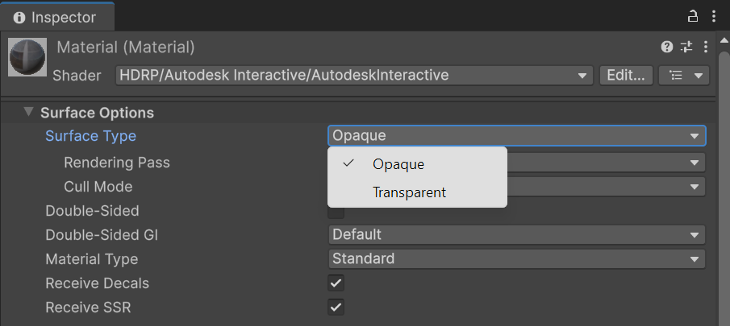</td>
<td>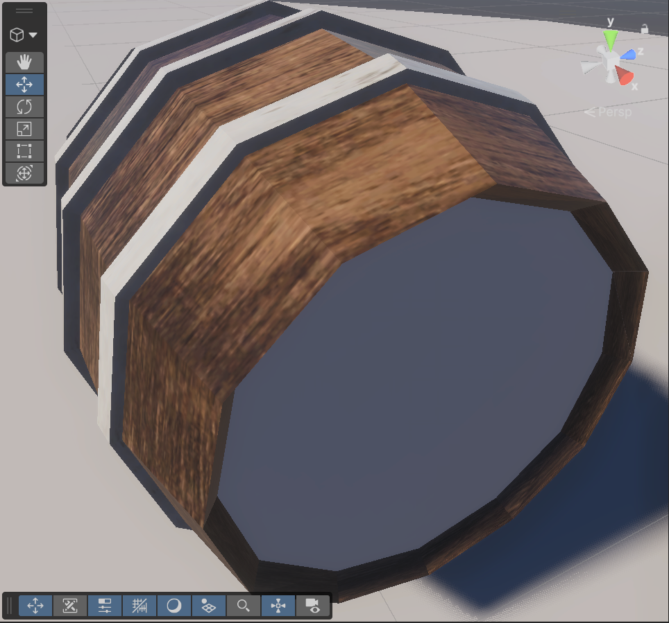</td>
</tr>
</table>

### 5. Fixing Top and Bottom UV Issues
The top and bottom of the barrel display pure white because Dust3D’s UVs are broken on caps. Edit the wood texture in a photo editor (change white background to darker brown) and re-import it.

<table>
<tr><th width="50%">Edited wood texture (white → brown)</th><th width="50%">Barrel with corrected texture</th></tr>
<tr>
<td>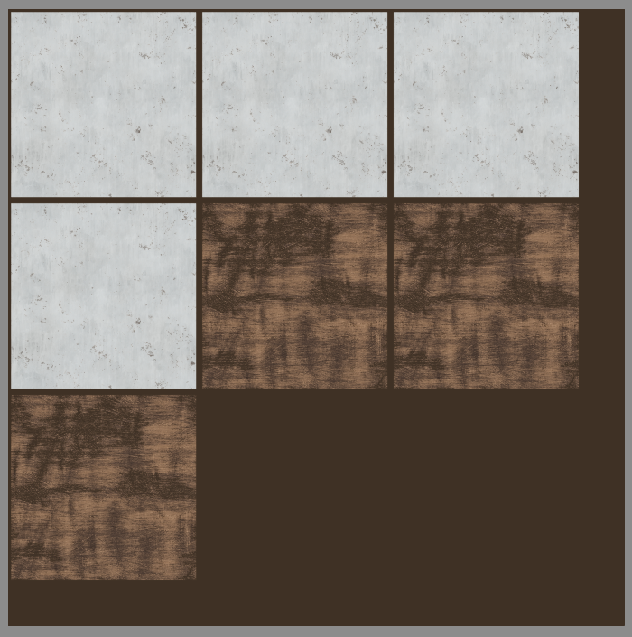</td>
<td>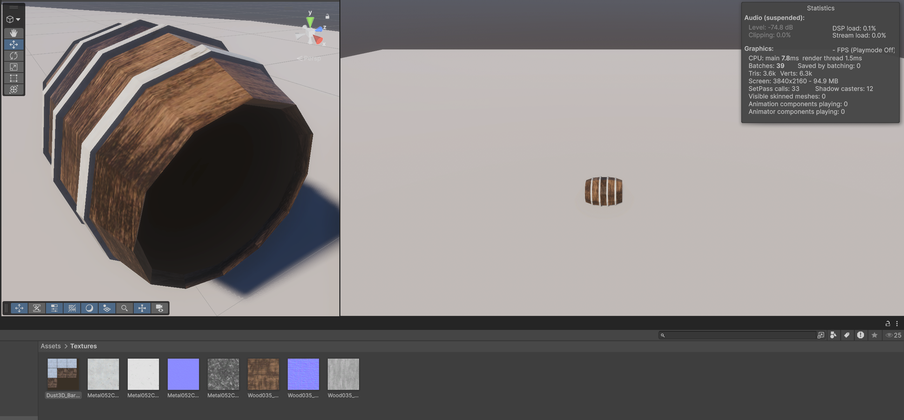</td>
</tr>
</table>

### 6. Adding Physics Components
Select the barrel and add:
- **Mesh Collider** (enable **Convex**)  
- **Rigidbody**  

Assign the custom **Barrel** Physics Material to the collider.

<table>
<tr><th width="50%">Adding Mesh Collider + Rigidbody</th><th width="50%">Adding Physics Material to the collider</th></tr>
<tr>
<td>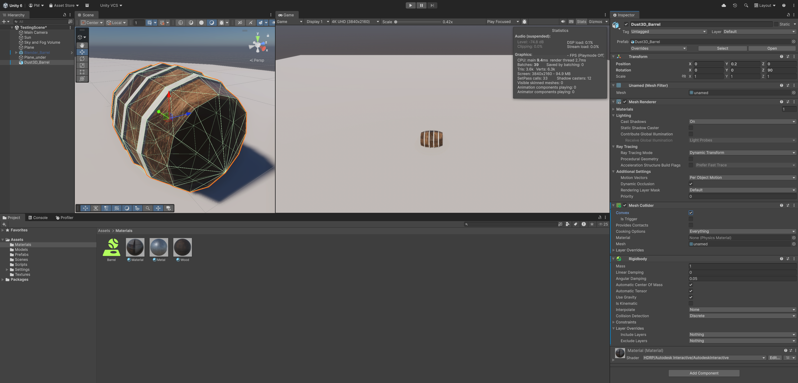</td>
<td>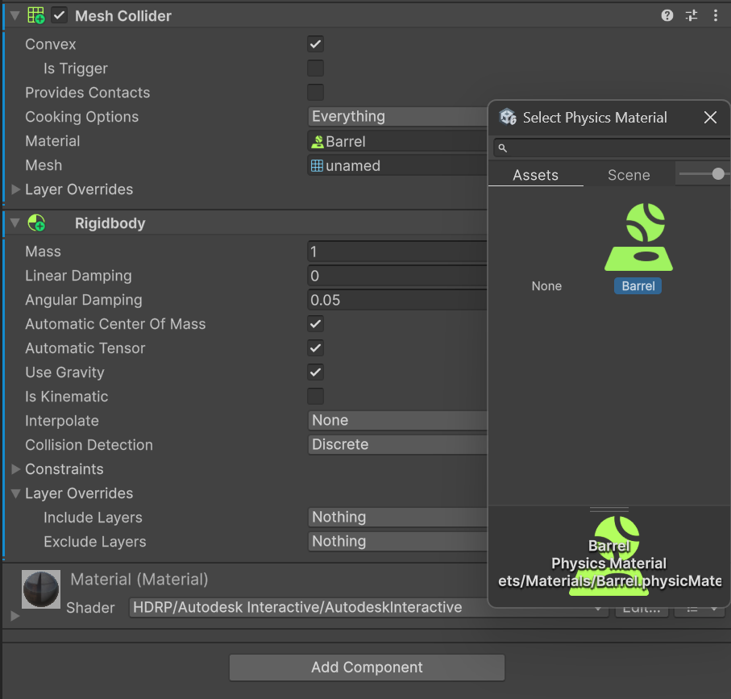</td>
</tr>
</table>

### 7. Creating a Prefab
Unpack the prefab if needed, then drag the barrel into the **Prefabs** folder to create a reusable prefab.

<table>
<tr><th width="100%">Creating the Dust3D barrel prefab</th></tr>
<tr><td>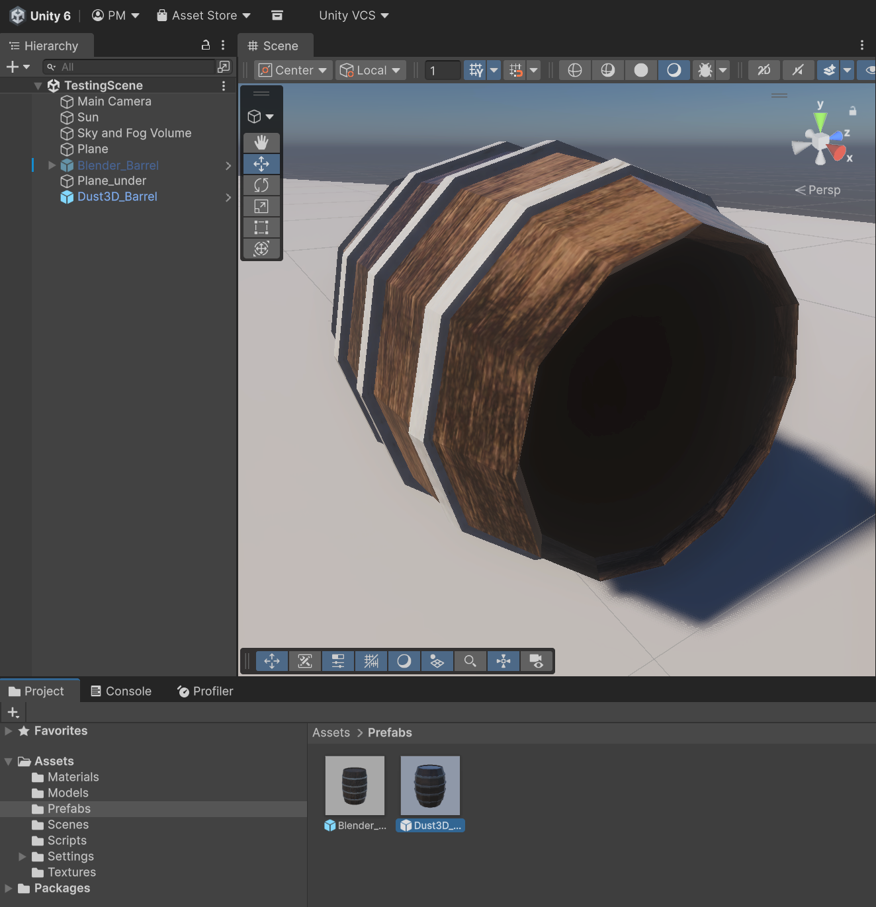</td></tr>
</table>

### 8. Camera Setup
Select the Main Camera and assign the barrel as the **Target** in the **Rotate Around** script so the camera orbits the object nicely.

<table>
<tr><th width="100%">Camera targeting the barrel</th></tr>
<tr><td>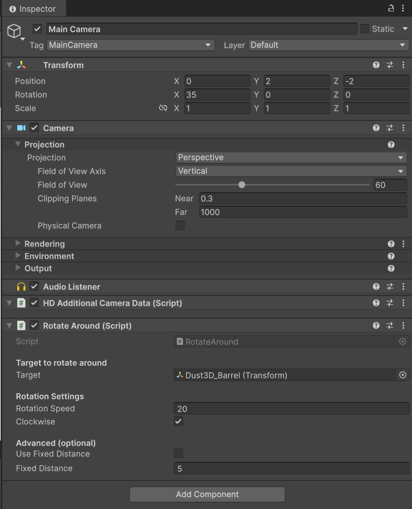</td></tr>
</table>

### 9. Size Comparison & Final Scaling
For consistency, place the Blender barrel next to the Dust3D barrel. The Dust3D version is smaller. Scale it to **2.5** on all axes (enable **Constrain Proportions**) and lift it to **Y = 0.5**. Apply changes to the prefab.

<table>
<tr>
    <th width="50%">Size comparison before scaling</th>
    <th width="50%">Scaled and lifted barrel (X/Y/Z = 2.5 / Y = 0.5)</th>
</tr>
<tr>
    <td>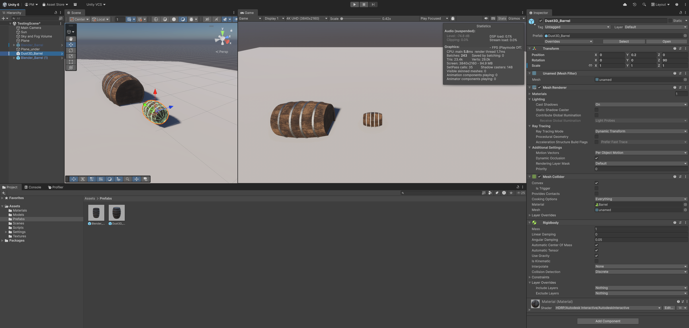</td>
    <td>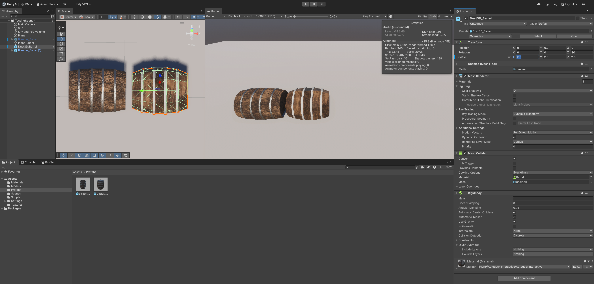</td>
</tr>
<tr>
    <th colspan="2">Applying changes to the prefab</th>
</tr>
<tr>
    <td colspan="2">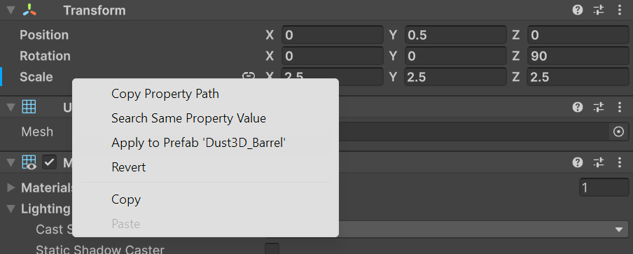</td>
</tr>
</table>

### 10. Physics & Rolling Test
Press Play. The barrel rolls naturally, falls off the edge, bounces lightly, and comes to rest on the ground. Because it is exported as **one single mesh**, no per-plank explosion or separation is possible.

<table>
<tr><th width="33%">Rolling test</th><th width="33%">Falling from height</th><th width="33%">Final resting position</th></tr>
<tr>
<td>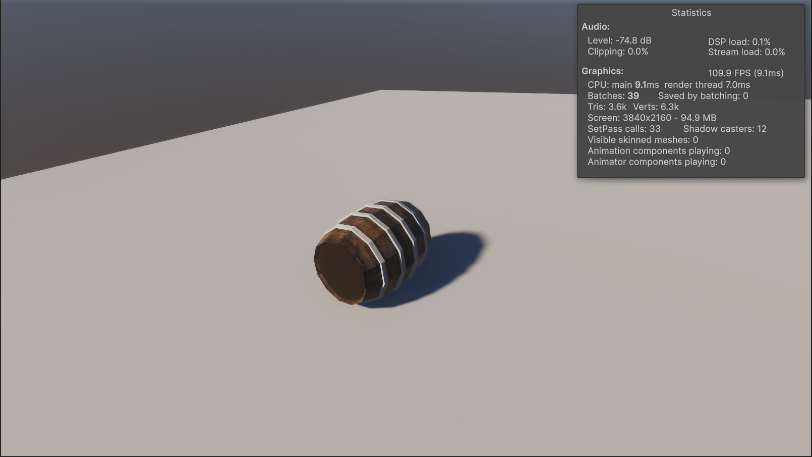</td>
<td>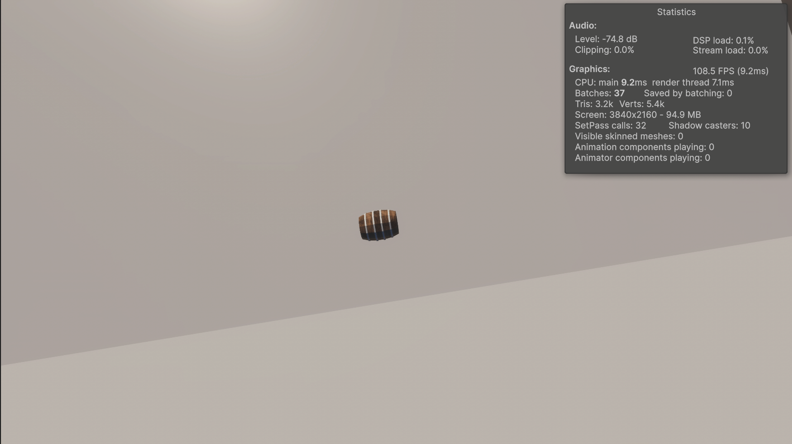</td>
<td>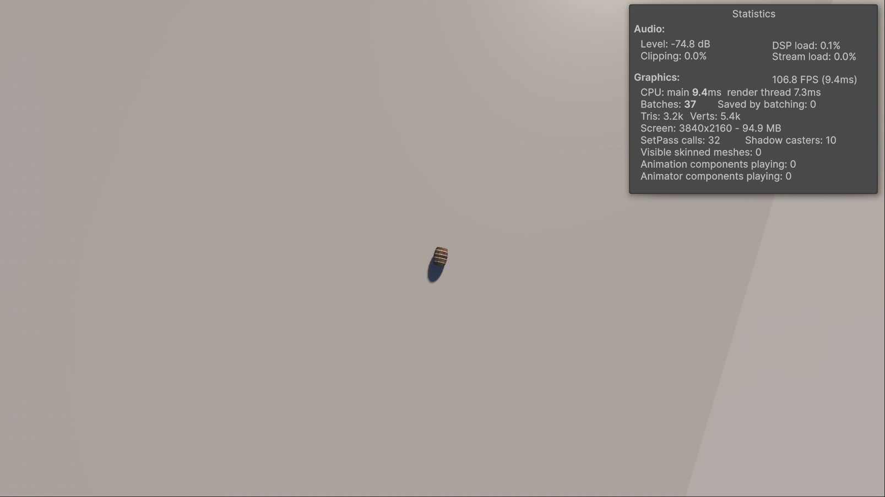</td>
</tr>
</table>

### 11. Performance Evaluation
Unity Stats panel (clean HDRP scene):

- **SetPass Calls:** 32
- **Draw Calls:** 37
- **Batches:** 37
- **Triangles:** 3.2k
- **Vertices:** 5.4k
- **FPS:** 100+ 

**Conclusion:** The Dust3D barrel imported easily and runs extremely light (only ~3.2k triangles). Physics works perfectly for basic rolling and falling, and the single-mesh approach gives excellent performance. However, the broken top/bottom UVs required manual texture editing, the model is permanently one object (no plank separation or explosion effect possible), and the overall visual quality is noticeably lower than the Blender version. It is ideal only for the simplest props where speed matters more than detail or interactivity.

**Documentation end.**
