# 3D Modeling in Games – Model Import & Testing Documentation

## Chapter 6: Importing and Testing the Barrel Model in Unity

This chapter focuses on importing the Wings3D-created barrel into Unity, fixing import-specific
issues (material setup, scale), configuring physics with a barrel explosion script, and evaluating
real-time performance. The goal is to verify how the multi-part separated mesh model behaves in
a game engine and to compare it with the previously imported models.

### 1. Importing the Model
Drag and drop **both** the `.obj` and `.mtl` files together into the **Assets > Models** folder.
Both files must be present for Unity to correctly resolve the material references on import.

<table>
<tr><th width="100%">Dragging both the .obj and .mtl files into the Unity Assets folder</th></tr>
<tr><td>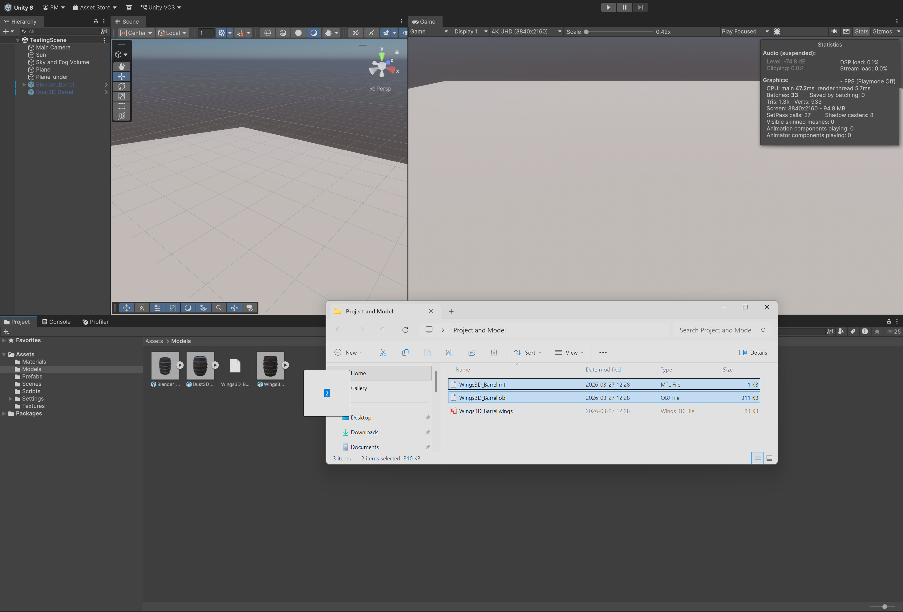</td></tr>
</table>

### 2. Extracting Materials
Click on the imported model in the **Inspector** and navigate to the **Materials** tab.
Click **Extract Materials** and direct them to the **Materials** folder in your project.

<table>
<tr><th width="100%">Inspector → Materials tab → Extract Materials</th></tr>
<tr><td>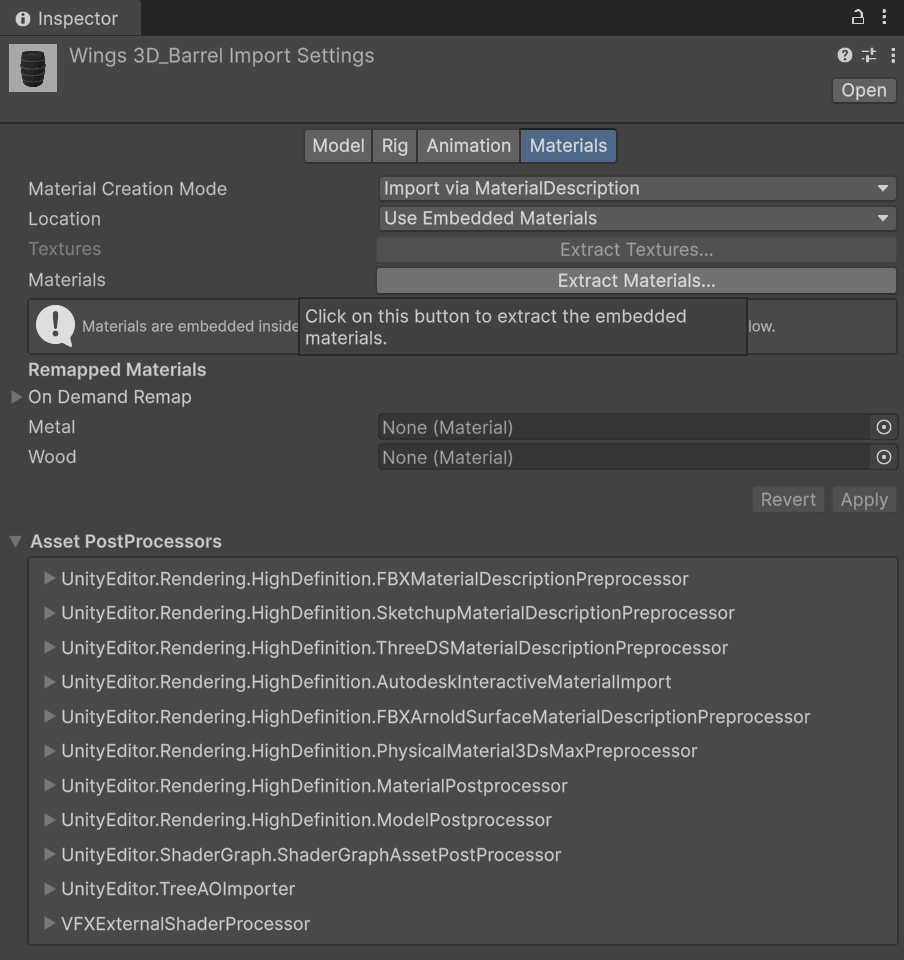</td></tr>
</table>

Two materials are extracted — **metal 1** and **wood 1** — which will need to be configured
manually to achieve the correct PBR appearance.

<table>
<tr><th width="100%">Extracted materials (metal 1, wood 1) visible in the folder and Inspector</th></tr>
<tr><td>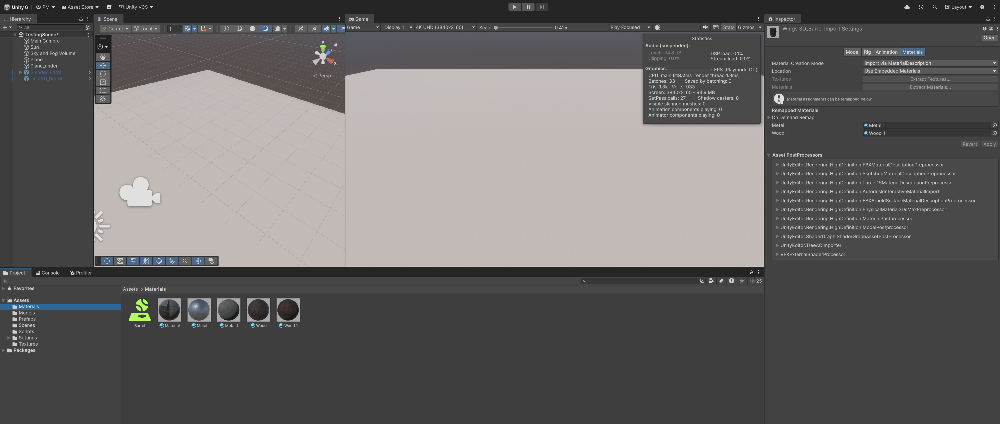</td></tr>
</table>

### 3. Configuring the Materials
Select the **metal 1** material in the Inspector and set **Metallic** to **1**, **Smoothness**
to **0.5**, and assign the missing Normal Map texture. Then select the **wood 1** material
and set **Smoothness** to **0.5** and assign its Normal Map as well.

<table>
<tr><th width="50%">Metal 1 material settings (Metallic: 1, Smoothness: 0.5, Normal Map assigned)</th><th width="50%">Wood 1 material settings (Smoothness: 0.5, Normal Map assigned)</th></tr>
<tr>
<td>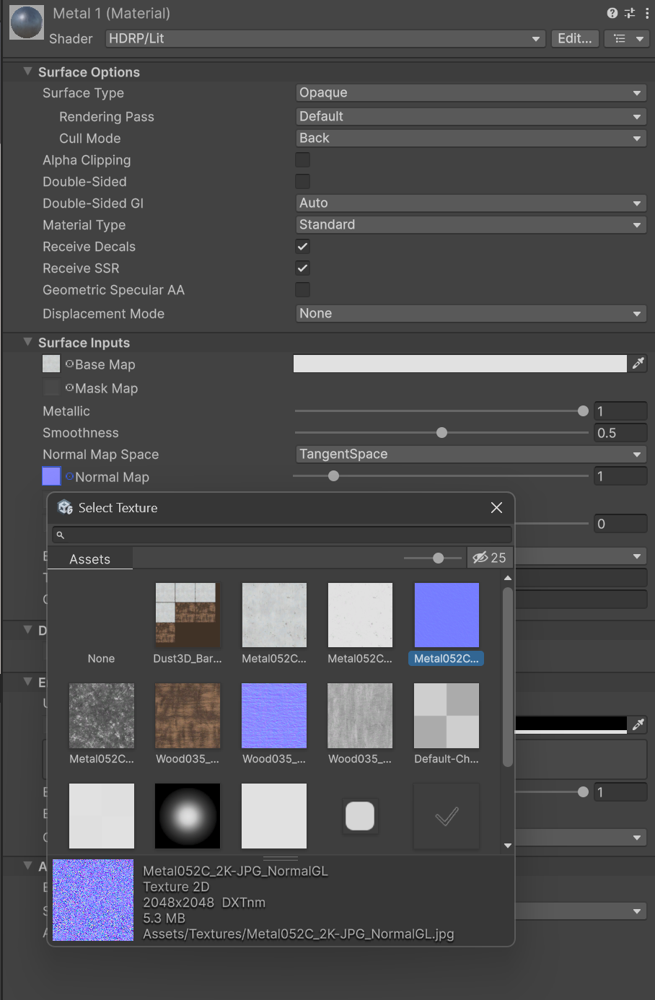</td>
<td>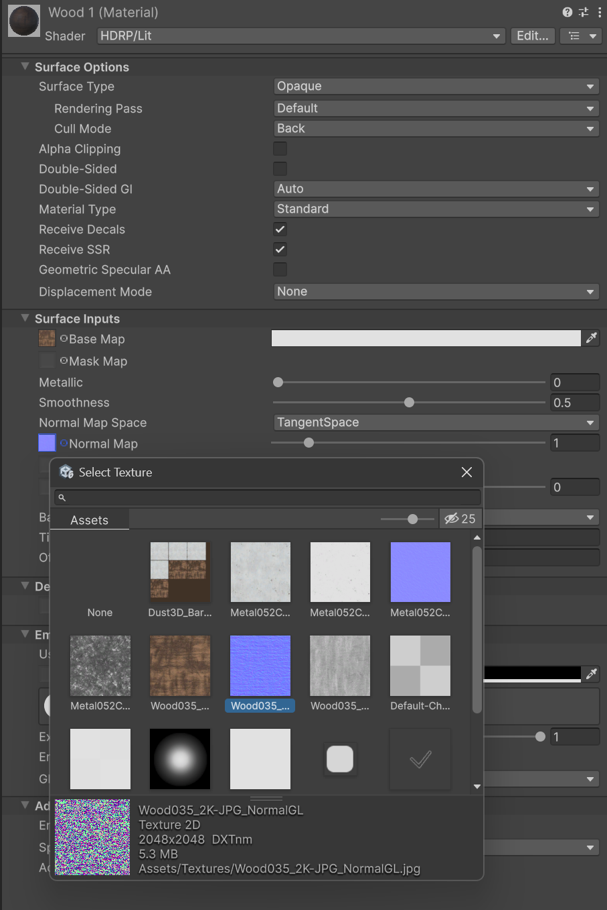</td>
</tr>
</table>

### 4. Placing the Model in the Scene and Identifying Scale Issues
Drag the barrel into the scene. Compared to the previously imported barrel models, the
Wings3D barrel is significantly oversized, meaning the scale must be corrected.

<table>
<tr><th width="100%">Size comparison — Wings3D barrel is much larger than the existing models</th></tr>
<tr><td>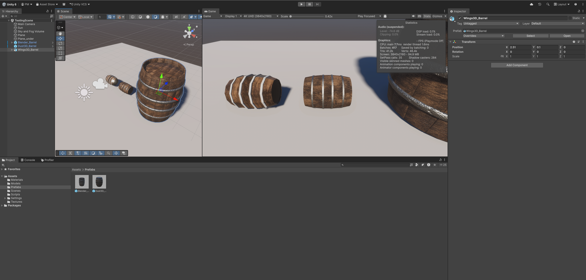</td></tr>
</table>

### 5. Correcting the Scale
To match the scale of the other barrels in the scene, set the barrel's **Scale** to **0.3**
on all three axes uniformly.

<table>
<tr><th width="100%">Barrel correctly scaled to 0.3 — matching the size of the other models</th></tr>
<tr><td>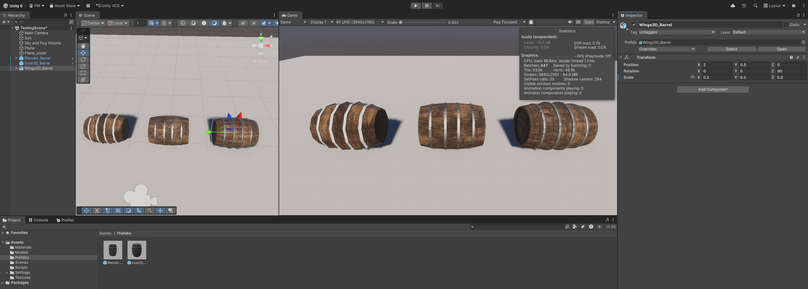</td></tr>
</table>

### 6. Unpacking the Prefab
Before adding components, right-click the barrel in the Hierarchy and choose
**Prefab** → **Unpack Completely**. This gives us full control over the object and its
children before turning it into our own custom prefab.

<table>
<tr><th width="100%">Right-click → Prefab → Unpack Completely</th></tr>
<tr><td>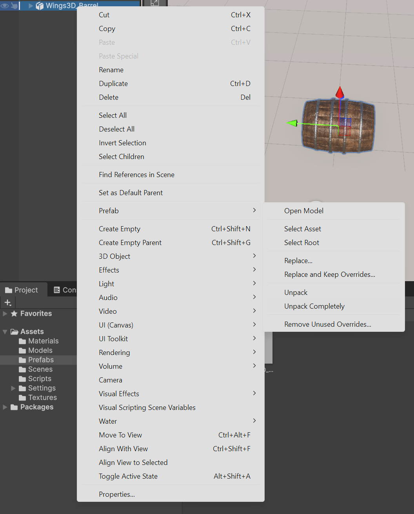</td></tr>
</table>

### 7. Adding Physics Components to the Parent
Select the root barrel object and add:
- **Rigidbody** — to enable physics simulation
- **Barrel Explode Script** — to handle the plank-separation explosion effect unique to
this multi-part model

<table>
<tr><th width="100%">Inspector showing Rigidbody and Barrel Explode Script added to the parent object</th></tr>
<tr><td>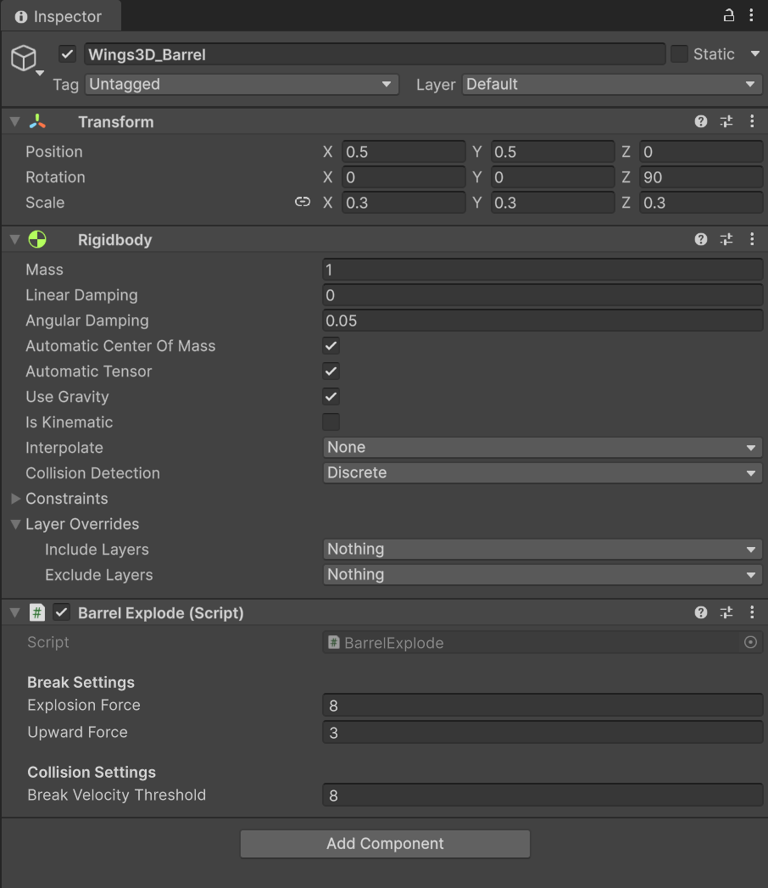</td></tr>
</table>

### 8. Adding Colliders to All Child Objects
Select every individual child object under the parent barrel. For each one, add a
**Mesh Collider**, enable **Convex**, and assign the custom **Barrel** Physics Material
to the collider. This ensures each separated plank and hoop participates correctly in
the physics simulation.

<table>
<tr><th width="100%">Child object Inspector showing Mesh Collider (Convex enabled) with Physics Material assigned</th></tr>
<tr><td>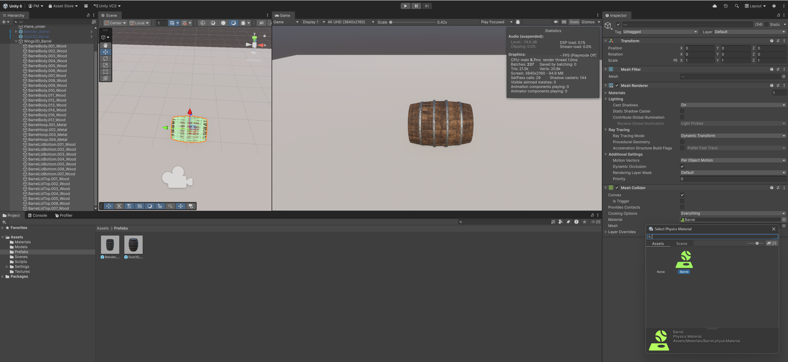</td></tr>
</table>

### 9. Creating a Prefab
With all components configured, drag the barrel from the Hierarchy into the **Prefabs**
folder to create a reusable prefab asset.

<table>
<tr><th width="100%">Dragging the barrel into the Prefabs folder to create the prefab</th></tr>
<tr><td>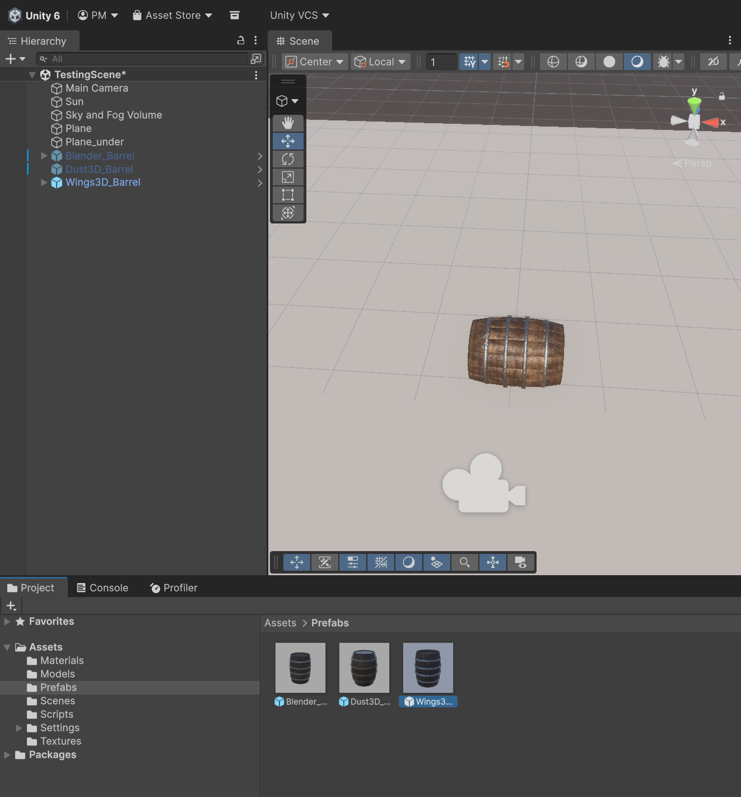</td></tr>
</table>

### 10. Camera Setup
Select the **Main Camera** and drag the barrel object from the scene Hierarchy into the
**Target** field of the **Rotate Around** script, so the camera orbits the barrel during
the simulation.

<table>
<tr><th width="100%">Main Camera — barrel assigned as Target in the Rotate Around script</th></tr>
<tr><td>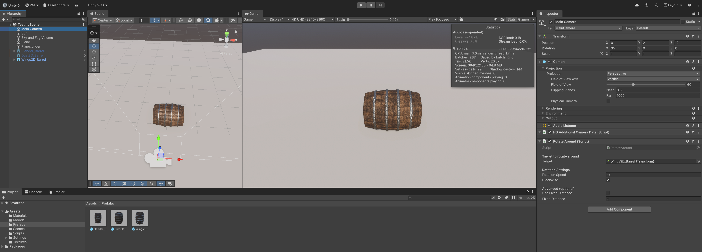</td></tr>
</table>

### 11. Physics & Explosion Test
Press **Play** and observe the barrel's behavior. Because this model consists of fully
separated individual mesh objects — one per plank and per hoop — the Barrel Explode Script
can separate each piece individually on impact, which is a major advantage over a single-mesh.

<table>
<tr><th width="33%">Barrel rolling along the surface</th><th width="33%">Barrel falling from height</th><th width="33%">Barrel fully exploded and pieces at rest</th></tr>
<tr>
<td>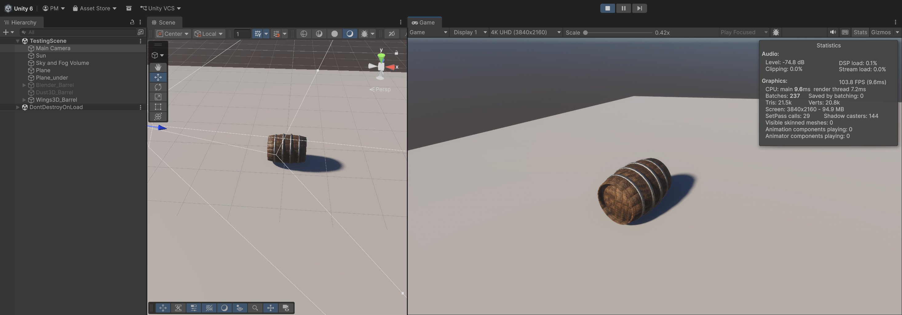</td>
<td>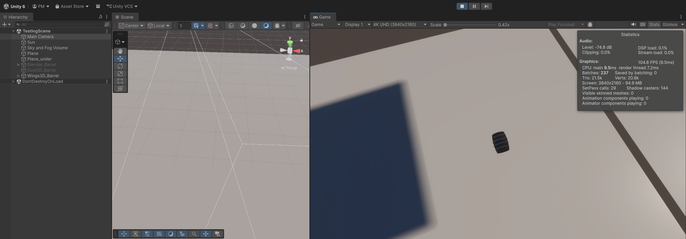</td>
<td>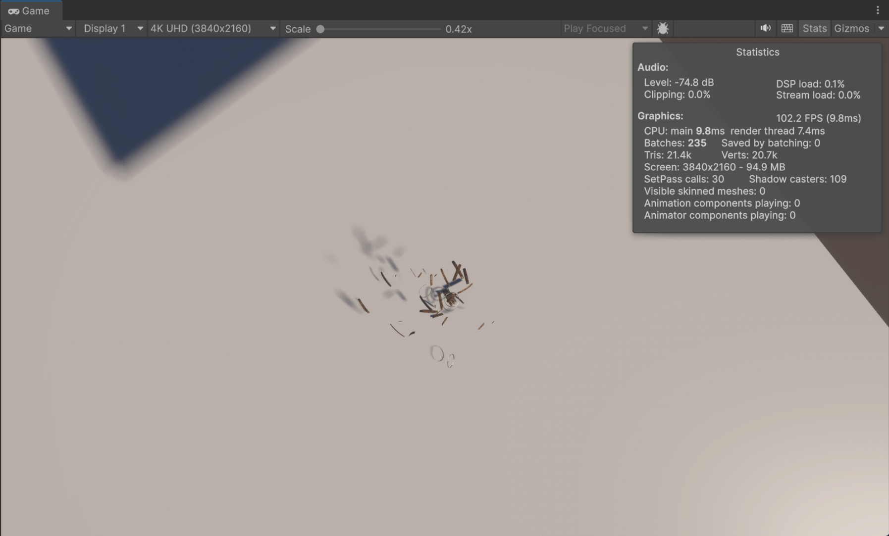</td>
</tr>
</table>

### 12. Performance Evaluation
Unity Stats panel (HDRP scene):

- **SetPass Calls:** 30
- **Draw Calls:** 236
- **Batches:** 236
- **Triangles:** 21.5k
- **Vertices:** 20.8k
- **FPS:** 100+

**Conclusion:** The Wings3D barrel imported cleanly and ran at a stable 100+ FPS throughout
the test. The multi-part mesh structure, achieved through the careful extraction workflow in
Wings3D, enables the barrel to physically explode into individual planks and hoops on impact —
a gameplay feature not possible with a single-mesh. The trade-off is a
significantly higher draw call count (236) due to each separate piece being its own draw
call, and a higher triangle count (~21.5k) resulting from the more detailed geometry.
Material configuration also required manual work after import, as Wings3D's OBJ export does not
embed PBR data. Overall, this model is the right choice for any scenario requiring destructible
or interactive barrel behavior.

**Documentation end.**
